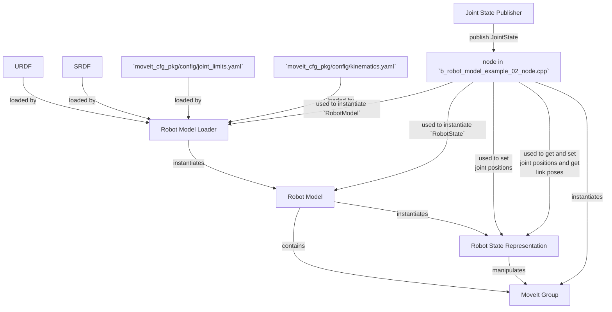

# What these examples do
These examples serve to understant the dependencies of `RobotModel`, `JointModelGroup` and `Robotstate`, how to instantiate them in a minimum set-up and to explore their features.

Setting up to start using the RobotModel class is very easy.
In general, you will find that most higher-level components will return a shared pointer to the RobotModel.
You should always use that when possible.
In these example, we will discuss only the basic API.
We will start by instantiating a `RobotModelLoader` object, then we will instante the required objects.

## Example 1 `a_create_model.launch` and `a_robot_model_example_01_node.cpp`
### Task 1 instantate a `robot_model_loader::RobotModelLoader`

```C++
  robot_model_loader::RobotModelLoader my_robot_model_loader("robot_description");
```
This requires the following set-up od ROS parameters
- `"robot_description"` URDF robot (local workspace?) description
- `"robot_description_semantic"` SRDF robot semantic description (generated by `moveit_setup_assistant` in `moveit_configuration_package/config`)
- Generated  by `moveit_setup_assistant` in `moveit_configuration_package/config/joint_limits.yaml`
    - `"robot_description_planning/joint_limits/JOINTNAME/has_acceleration_limits"` 
    - `"robot_description_planning/joint_limits/JOINTNAME/has_velocity_limits"`
    - `"robot_description_planning/joint_limits/JOINTNAME/max_acceleration"`
    - `"robot_description_planning/joint_limits/JOINTNAME/max_velocity"`
- Generated  by `moveit_setup_assistant` in `moveit_configuration_package/config/kinematics.yaml`
    - `"robot_description_kinematics/PLANNING_GROUP_NAME/kinematics_solver"`
    - `"robot_description_kinematics/PLANNING_GROUP_NAME/kinematics_solver_search_resolution"`
    - `"robot_description_kinematics/PLANNING_GROUP_NAME/kinematics_solver_timeout"`

### Task 2 get an instance of `RobotModel` 
```C++
  const robot_model::RobotModelPtr &my_robot_model =
        my_robot_model_loader.getModel();
```

### Task 3 Explore `JointModelGroup` 
- **Get the groups info**
    - **Groups in the model**
    ```C++
        const std::vector<std::string> &group_names = my_robot_model->getJointModelGroupNames();
    ```
    - **Get a group by its name**
    ```C++
      const moveit::core::JointModelGroup *joint_model_group =
          my_robot_model->getJointModelGroup(group_name);
    ```
    - **If group is an end-effector**
    ```C++
      bool is_end_effector = my_robot_model->hasEndEffector(group_name);
    ```
    - **Joint Names associated to a group**
    ```C++
      const std::vector<std::string> &variable_names =
          joint_model_group->getVariableNames();
    ```
    - **Link Names associated to a group**
    ```C++
      const std::vector<std::string> &link_names =
          joint_model_group->getLinkModelNames();
    ```
### Task 4 Instantiate a `RobotState`

A robot State may be constructed using a robot model
```C++
    robot_state::RobotState * pointer = new robot_state::RobotState(my_robot_model)
```
But in this example we use smart poiters
```C++
  robot_state::RobotStatePtr my_kinematic_model(
      new robot_state::RobotState(my_robot_model));
```

### Task 5 Get the joint values of the `JointModelGroup`
```C++
      my_kinematic_model->copyJointGroupPositions(joint_model_group_instance,
                                                  joint_values);
```

### Task 6 Get the Pose of a link
```C++
        const Eigen::Isometry3d &link_pose =
                    my_kinematic_model->getGlobalLinkTransform(link_name_string);
```
## Example 2 `b_monitor_state.launch` and `b_robot_model_example_02_node.cpp`

We use this example to simulate how to monitor the state of a robot using MoveIt


# Methods and clases used in this example
- `robot_model_loader::RobotModelLoader`
    - `robot_model_loader::RobotModelLoadergetModel`
- `moveit::core::RobotModel`
    - `moveit::core::RobotModel::getJointModelGroupNames`
    - `moveit::core::RobotModel::hasEndEffector`, verifies if a string correstpont to the name of and end effector group
    - `moveit::core::RobotModel::getJointModelGroup` get a pointer to `moveit::core::JointModelGroup` given the string with the name of the group

- `moveit::core::JointModelGroup`
    - `moveit::core::JointModelGroup::getVariableNames` **the variables are the joints** returns a vector of strings with the names of the joints in the group

