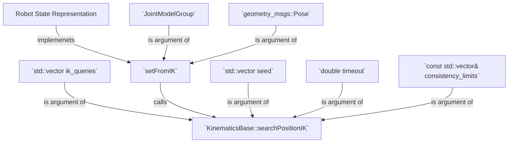

# Moveit Kinematics

## Moveit Inverse kinematics

The main functions is [`RobotState::setFromIK`](https://github.com/ros-planning/moveit/blob/9271e6a2edbeed291b7c713f55000bbc59d37b9e/moveit_core/robot_state/src/robot_state.cpp#L1574) which calls [`KinematicsBase::searchPositionIK`](https://github.com/ros-planning/moveit/blob/f2cc2348de83557a5704cc0f8670413f37a7855d/moveit_core/kinematics_base/include/moveit/kinematics_base/kinematics_base.h#L297) [here](https://github.com/ros-planning/moveit/blob/9271e6a2edbeed291b7c713f55000bbc59d37b9e/moveit_core/robot_state/src/robot_state.cpp#L1795).

- [kinematic base plugin](https://github.com/ros-planning/moveit/blob/f2cc2348de83557a5704cc0f8670413f37a7855d/moveit_core/kinematics_base/include/moveit/kinematics_base/kinematics_base.h#L146)

| Kinematic base method | type | use |
| --------------------  | ---- | --- |
| `getPositionIK`       | VIRTUAL | Given a desired pose of the end-effector, compute the joint angles to reach it |
| `searchPositionIK` (3 variations)   | VIRTUAL | Numerical method to search e.g. SVD  [here](https://github.com/ros-planning/moveit/blob/f2cc2348de83557a5704cc0f8670413f37a7855d/moveit_core/kinematics_base/include/moveit/kinematics_base/kinematics_base.h#L211)|
| `getPositionFK` | VIRTUAL | computes forward kinematics |
| `getJointNames` | virtual | Return all the joint names in the order they are used internally |
| `getLinkNames`  | virtual | Return all the joint names in the order they are used internally |
| `setValues`     |         | [here](https://github.com/ros-planning/moveit/blob/f2cc2348de83557a5704cc0f8670413f37a7855d/moveit_core/kinematics_base/src/kinematics_base.cpp#L70)  <br/>|


- [discretization error](https://github.com/ros-planning/moveit/blob/f2cc2348de83557a5704cc0f8670413f37a7855d/moveit_core/kinematics_base/include/moveit/kinematics_base/kinematics_base.h#L69)

- [kinematic error](https://github.com/ros-planning/moveit/blob/f2cc2348de83557a5704cc0f8670413f37a7855d/moveit_core/kinematics_base/include/moveit/kinematics_base/kinematics_base.h#L87)  

- [querry options](https://github.com/ros-planning/moveit/blob/f2cc2348de83557a5704cc0f8670413f37a7855d/moveit_core/kinematics_base/include/moveit/kinematics_base/kinematics_base.h#L109)

- [kineamtic result](https://github.com/ros-planning/moveit/blob/f2cc2348de83557a5704cc0f8670413f37a7855d/moveit_core/kinematics_base/include/moveit/kinematics_base/kinematics_base.h#L133)

- [kinematic solver info](http://docs.ros.org/en/api/moveit_msgs/html/msg/KinematicSolverInfo.html)


## KDL kinematics plugins

| Paramter  | type | function |
| --------  | ---- | -------- |
| `max_solver_iterations` | `uint` | |
| `epsilon` | | |
| `orientation_vs_position` | | |
| `position_only_ik` |||
| `joint_weights/weights` |||
| `joint_weights/names` |||

It is declared [here](https://github.com/ros-planning/moveit/blob/f2cc2348de83557a5704cc0f8670413f37a7855d/moveit_kinematics/kdl_kinematics_plugin/include/moveit/kdl_kinematics_plugin/kdl_kinematics_plugin.h#L72) and defined [here](https://github.com/ros-planning/moveit/blob/noetic-devel/moveit_kinematics/kdl_kinematics_plugin/src/kdl_kinematics_plugin.cpp).

### KDL Forward/Direct Kinematics

The KDL Forward Kinematics in defined [here](https://github.com/ros-planning/moveit/blob/f2cc2348de83557a5704cc0f8670413f37a7855d/moveit_kinematics/kdl_kinematics_plugin/src/kdl_kinematics_plugin.cpp#L522)

### Inverse Kinematics

The inverse kinematics is defined [here](https://github.com/ros-planning/moveit/blob/f2cc2348de83557a5704cc0f8670413f37a7855d/moveit_kinematics/kdl_kinematics_plugin/src/kdl_kinematics_plugin.cpp#L316).
It uses the auxiliar function [`CartToJnt`](https://github.com/ros-planning/moveit/blob/f2cc2348de83557a5704cc0f8670413f37a7855d/moveit_kinematics/kdl_kinematics_plugin/src/kdl_kinematics_plugin.cpp#L422),  the auxiliar class `ChainIkSolverVelMimicSVD` (declared [here](https://github.com/ros-planning/moveit/blob/9271e6a2edbeed291b7c713f55000bbc59d37b9e/moveit_kinematics/kdl_kinematics_plugin/include/moveit/kdl_kinematics_plugin/chainiksolver_vel_mimic_svd.hpp#L46) and its method [`ChainIkSolverVelMimicSVD::CartToJnt`](https://github.com/ros-planning/moveit/blob/9271e6a2edbeed291b7c713f55000bbc59d37b9e/moveit_kinematics/kdl_kinematics_plugin/src/chainiksolver_vel_mimic_svd.cpp#L87).

The class `ChainIkSolverVelMimicSVD` inherits from [`KDL::ChainIkSolverVel`](https://github.com/orocos/orocos_kinematics_dynamics/blob/6ed703443b093ea65c9e7bff31b84c438e0b197f/orocos_kdl/src/chainiksolver.hpp#L66), implements the SVD [here in `ChainIkSolverVelMimicSVD::CartToJnt`](https://github.com/ros-planning/moveit/blob/9271e6a2edbeed291b7c713f55000bbc59d37b9e/moveit_kinematics/kdl_kinematics_plugin/src/chainiksolver_vel_mimic_svd.cpp#L117) and initializes an instance of `Eigen::JacobiSVD<Eigen::MatrixXd>` [here](https://github.com/ros-planning/moveit/blob/9271e6a2edbeed291b7c713f55000bbc59d37b9e/moveit_kinematics/kdl_kinematics_plugin/src/chainiksolver_vel_mimic_svd.cpp#L53).

It uses [`clipToJointLimits`](https://github.com/ros-planning/moveit/blob/f2cc2348de83557a5704cc0f8670413f37a7855d/moveit_kinematics/kdl_kinematics_plugin/src/kdl_kinematics_plugin.cpp#L503).


- `KDL::Jacobian` [declared here](https://github.com/orocos/orocos_kinematics_dynamics/blob/6ed703443b093ea65c9e7bff31b84c438e0b197f/orocos_kdl/src/jacobian.hpp#L36) and [defined here](https://github.com/orocos/orocos_kinematics_dynamics/blob/6ed703443b093ea65c9e7bff31b84c438e0b197f/orocos_kdl/src/jacobian.cpp#L28).


[here](https://github.com/ros-planning/moveit/blob/f2cc2348de83557a5704cc0f8670413f37a7855d/moveit_kinematics/kdl_kinematics_plugin/src/kdl_kinematics_plugin.cpp#L366)

### Initialization Implementation

```C++
bool KDLKinematicsPlugin::initialize(const moveit::core::RobotModel& robot_model, const std::string& group_name,
                                     const std::string& base_frame, const std::vector<std::string>& tip_frames,
                                     double search_discretization)
{
  storeValues(robot_model, group_name, base_frame, tip_frames, search_discretization);
  joint_model_group_ = robot_model_->getJointModelGroup(group_name);

  KDL::Tree kdl_tree;

  kdl_parser::treeFromUrdfModel(*robot_model.getURDF(), kdl_tree);
  kdl_tree.getChain(base_frame_, getTipFrame(), kdl_chain_);

  dimension_ = joint_model_group_->getActiveJointModels().size() + joint_model_group_->getMimicJointModels().size();
  for (std::size_t i = 0; i < joint_model_group_->getJointModels().size(); ++i)
  {
    if (joint_model_group_->getJointModels()[i]->getType() == moveit::core::JointModel::REVOLUTE ||
        joint_model_group_->getJointModels()[i]->getType() == moveit::core::JointModel::PRISMATIC)
    {
      solver_info_.joint_names.push_back(joint_model_group_->getJointModelNames()[i]);
      const std::vector<moveit_msgs::JointLimits>& jvec =
          joint_model_group_->getJointModels()[i]->getVariableBoundsMsg();
      solver_info_.limits.insert(solver_info_.limits.end(), jvec.begin(), jvec.end());
    }
  }

  solver_info_.link_names.push_back(getTipFrame());

  joint_min_.resize(solver_info_.limits.size());
  joint_max_.resize(solver_info_.limits.size());

  for (unsigned int i = 0; i < solver_info_.limits.size(); i++)
  {
    joint_min_(i) = solver_info_.limits[i].min_position;
    joint_max_(i) = solver_info_.limits[i].max_position;
  }

  // Get Solver Parameters
  lookupParam("max_solver_iterations", max_solver_iterations_, 500);
  lookupParam("epsilon", epsilon_, 1e-5);
  lookupParam("orientation_vs_position", orientation_vs_position_weight_, 1.0);

  bool position_ik;
  lookupParam("position_only_ik", position_ik, false);
  if (position_ik)  // position_only_ik overrules orientation_vs_position
    orientation_vs_position_weight_ = 0.0;

  getJointWeights(); // get weights parameters

  // Check for mimic joints
  unsigned int joint_counter = 0;
  for (std::size_t i = 0; i < kdl_chain_.getNrOfSegments(); ++i)
  {
    const moveit::core::JointModel* jm = robot_model_->getJointModel(kdl_chain_.segments[i].getJoint().getName());

    // first check whether it belongs to the set of active joints in the group
    if (jm->getMimic() == nullptr && jm->getVariableCount() > 0)
    {
      JointMimic mimic_joint;
      mimic_joint.reset(joint_counter);
      mimic_joint.joint_name = kdl_chain_.segments[i].getJoint().getName();
      mimic_joint.active = true;
      mimic_joints_.push_back(mimic_joint);
      ++joint_counter;
      continue;
    }
    if (joint_model_group_->hasJointModel(jm->getName()))
    {
      if (jm->getMimic() && joint_model_group_->hasJointModel(jm->getMimic()->getName()))
      {
        JointMimic mimic_joint;
        mimic_joint.joint_name = kdl_chain_.segments[i].getJoint().getName();
        mimic_joint.offset = jm->getMimicOffset();
        mimic_joint.multiplier = jm->getMimicFactor();
        mimic_joints_.push_back(mimic_joint);
      }
    }
  }
  for (JointMimic& mimic_joint : mimic_joints_)
  {
    if (!mimic_joint.active)
    {
      const moveit::core::JointModel* joint_model =
          joint_model_group_->getJointModel(mimic_joint.joint_name)->getMimic();
      for (JointMimic& mimic_joint_recal : mimic_joints_)
      {
        if (mimic_joint_recal.joint_name == joint_model->getName())
        {
          mimic_joint.map_index = mimic_joint_recal.map_index;
        }
      }
    }
  }

  // Setup the joint state groups that we need
  state_ = std::make_shared<moveit::core::RobotState>(robot_model_);

  fk_solver_ = std::make_unique<KDL::ChainFkSolverPos_recursive>(kdl_chain_);

  initialized_ = true;
  return true;
}
```


### KDL Forward/Direct Kinematics Implementation
```C++
bool KDLKinematicsPlugin::getPositionFK(const std::vector<std::string>& link_names,
                                        const std::vector<double>& joint_angles,
                                        std::vector<geometry_msgs::Pose>& poses) const
{
  poses.resize(link_names.size());

  KDL::Frame p_out;
  KDL::JntArray jnt_pos_in(dimension_);
  jnt_pos_in.data = Eigen::Map<const Eigen::VectorXd>(joint_angles.data(), joint_angles.size());

  bool valid = true;
  for (unsigned int i = 0; i < poses.size(); i++)
  {
    fk_solver_->JntToCart(jnt_pos_in, p_out);
    poses[i] = tf2::toMsg(p_out);
  }
  return valid;
}
```

### KDL Inverse Kinematics Implementation

```C++
bool KDLKinematicsPlugin::searchPositionIK(const geometry_msgs::Pose& ik_pose, const std::vector<double>& ik_seed_state,
                                           double timeout, const std::vector<double>& consistency_limits,
                                           std::vector<double>& solution, const IKCallbackFn& solution_callback,
                                           moveit_msgs::MoveItErrorCodes& error_code,
                                           const kinematics::KinematicsQueryOptions& options) const
{
  ros::WallTime start_time = ros::WallTime::now();

  // Resize consistency limits to remove mimic joints
  std::vector<double> consistency_limits_mimic;
  if (!consistency_limits.empty())
  {
    if (consistency_limits.size() != dimension_)
    {
      ROS_ERROR_STREAM_NAMED("kdl", "Consistency limits must be empty or have size "
                                        << dimension_ << " instead of size " << consistency_limits.size());
      error_code.val = error_code.NO_IK_SOLUTION;
      return false;
    }

    for (std::size_t i = 0; i < dimension_; ++i)
    {
      if (mimic_joints_[i].active)
        consistency_limits_mimic.push_back(consistency_limits[i]);
    }
  }
  Eigen::Matrix<double, 6, 1> cartesian_weights;
  cartesian_weights.topRows<3>().setConstant(1.0);
  cartesian_weights.bottomRows<3>().setConstant(orientation_vs_position_weight_);

  KDL::JntArray jnt_seed_state(dimension_);
  KDL::JntArray jnt_pos_in(dimension_);
  KDL::JntArray jnt_pos_out(dimension_);
  jnt_seed_state.data = Eigen::Map<const Eigen::VectorXd>(ik_seed_state.data(), ik_seed_state.size());
  jnt_pos_in = jnt_seed_state;

  KDL::ChainIkSolverVelMimicSVD ik_solver_vel(kdl_chain_, mimic_joints_, orientation_vs_position_weight_ == 0.0);
  solution.resize(dimension_);

  KDL::Frame pose_desired;
  tf2::fromMsg(ik_pose, pose_desired);

  ROS_DEBUG_STREAM_NAMED("kdl", "searchPositionIK: Position request pose is "
                                    << ik_pose.position.x << " " << ik_pose.position.y << " " << ik_pose.position.z
                                    << " " << ik_pose.orientation.x << " " << ik_pose.orientation.y << " "
                                    << ik_pose.orientation.z << " " << ik_pose.orientation.w);

  unsigned int attempt = 0;
  do
  {
    ++attempt;
    if (attempt > 1)  // randomly re-seed after first attempt
    {
      if (!consistency_limits_mimic.empty())
        getRandomConfiguration(jnt_seed_state.data, consistency_limits_mimic, jnt_pos_in.data);
      else
        getRandomConfiguration(jnt_pos_in.data);
      ROS_DEBUG_STREAM_NAMED("kdl", "New random configuration (" << attempt << "): " << jnt_pos_in);
    }

    int ik_valid =
        CartToJnt(ik_solver_vel, jnt_pos_in, pose_desired, jnt_pos_out, max_solver_iterations_,
                  Eigen::Map<const Eigen::VectorXd>(joint_weights_.data(), joint_weights_.size()), cartesian_weights);
    if (ik_valid == 0 || options.return_approximate_solution)  // found acceptable solution
    {
      if (!consistency_limits_mimic.empty() &&
          !checkConsistency(jnt_seed_state.data, consistency_limits_mimic, jnt_pos_out.data))
        continue;

      Eigen::Map<Eigen::VectorXd>(solution.data(), solution.size()) = jnt_pos_out.data;
      if (!solution_callback.empty())
      {
        solution_callback(ik_pose, solution, error_code);
        if (error_code.val != error_code.SUCCESS)
          continue;
      }

      // solution passed consistency check and solution callback
      error_code.val = error_code.SUCCESS;
      ROS_DEBUG_STREAM_NAMED("kdl", "Solved after " << (ros::WallTime::now() - start_time).toSec() << " < " << timeout
                                                    << "s and " << attempt << " attempts");
      return true;
    }
  } while (!timedOut(start_time, timeout));

  ROS_DEBUG_STREAM_NAMED("kdl", "IK timed out after " << (ros::WallTime::now() - start_time).toSec() << " > " << timeout
                                                      << "s and " << attempt << " attempts");
  error_code.val = error_code.TIMED_OUT;
  return false;
}

int KDLKinematicsPlugin::CartToJnt(KDL::ChainIkSolverVelMimicSVD& ik_solver, const KDL::JntArray& q_init,
                                   const KDL::Frame& p_in, KDL::JntArray& q_out, const unsigned int max_iter,
                                   const Eigen::VectorXd& joint_weights, const Twist& cartesian_weights) const
{
  double last_delta_twist_norm = DBL_MAX;
  double step_size = 1.0;
  KDL::Frame f;
  KDL::Twist delta_twist;
  KDL::JntArray delta_q(q_out.rows()), q_backup(q_out.rows());
  Eigen::ArrayXd extra_joint_weights(joint_weights.rows());
  extra_joint_weights.setOnes();

  q_out = q_init;

  unsigned int i;
  bool success = false;
  for (i = 0; i < max_iter; ++i)
  {
    fk_solver_->JntToCart(q_out, f);
    delta_twist = diff(f, p_in);

    const double position_error = delta_twist.vel.Norm();
    const double orientation_error = ik_solver.isPositionOnly() ? 0 : delta_twist.rot.Norm();
    const double delta_twist_norm = std::max(position_error, orientation_error);
    if (delta_twist_norm <= epsilon_)
    {
      success = true;
      break;
    }

    if (delta_twist_norm >= last_delta_twist_norm)
    {
      // if the error increased, we are close to a singularity -> reduce step size
      double old_step_size = step_size;
      step_size *= std::min(0.2, last_delta_twist_norm / delta_twist_norm);  // reduce scale;
      KDL::Multiply(delta_q, step_size / old_step_size, delta_q);
      ROS_DEBUG_NAMED("kdl", "      error increased: %f -> %f, scale: %f", last_delta_twist_norm, delta_twist_norm,
                      step_size);
      q_out = q_backup;  // restore previous unclipped joint values
    }
    else
    {
      q_backup = q_out;  // remember joint values of last successful step
      step_size = 1.0;   // reset step size
      last_delta_twist_norm = delta_twist_norm;

      ik_solver.CartToJnt(q_out, delta_twist, delta_q, extra_joint_weights * joint_weights.array(), cartesian_weights);
    }

    clipToJointLimits(q_out, delta_q, extra_joint_weights);

    const double delta_q_norm = delta_q.data.lpNorm<1>();
    ROS_DEBUG_NAMED("kdl", "[%3d] pos err: %f  rot err: %f  delta_q: %f", i, position_error, orientation_error,
                    delta_q_norm);
    if (delta_q_norm < epsilon_)  // stuck in singularity
    {
      if (step_size < epsilon_)  // cannot reach target
        break;
      // wiggle joints
      last_delta_twist_norm = DBL_MAX;
      delta_q.data.setRandom();
      delta_q.data *= std::min(0.1, delta_twist_norm);
      clipToJointLimits(q_out, delta_q, extra_joint_weights);
      extra_joint_weights.setOnes();
    }

    KDL::Add(q_out, delta_q, q_out);

    ROS_DEBUG_STREAM_NAMED("kdl", "      delta_q: " << delta_q);
    ROS_DEBUG_STREAM_NAMED("kdl", "      q: " << q_out);
  }

  int result = (i == max_iter) ? -3 : (success ? 0 : -2);
  ROS_DEBUG_STREAM_NAMED("kdl", "Result " << result << " after " << i << " iterations: " << q_out);

  return result;
}
```

```C++
int ChainIkSolverVelMimicSVD::CartToJnt(const JntArray& q_in, const Twist& v_in, JntArray& qdot_out,
                                        const Eigen::VectorXd& joint_weights,
                                        const Eigen::Matrix<double, 6, 1>& cartesian_weights)
{
  // Let the ChainJntToJacSolver calculate the Jacobian for the current joint positions q_in.
  if (num_mimic_joints_ > 0)
  {
    jnt2jac_.JntToJac(q_in, jac_);
    // Now compute the actual jacobian that involves only the active DOFs
    jacToJacReduced(jac_, jac_reduced_);
  }
  else
    jnt2jac_.JntToJac(q_in, jac_reduced_);

  // weight Jacobian
  auto& jac = jac_reduced_.data;
  const Eigen::Index rows = svd_.rows();  // only operate on position rows?
  jac.topRows(rows) *= joint_weights.asDiagonal();
  jac.topRows(rows).transpose() *= cartesian_weights.topRows(rows).asDiagonal();

  // transform v_in to 6D Eigen::Vector
  Eigen::Matrix<double, 6, 1> vin;
  vin.topRows<3>() = Eigen::Map<const Eigen::Array3d>(v_in.vel.data, 3) * cartesian_weights.topRows<3>().array();
  vin.bottomRows<3>() = Eigen::Map<const Eigen::Array3d>(v_in.rot.data, 3) * cartesian_weights.bottomRows<3>().array();

  // Do a singular value decomposition: J = U*S*V^t
  svd_.compute(jac.topRows(rows));

  if (num_mimic_joints_ > 0)
  {
    qdot_out_reduced_.noalias() = svd_.solve(vin.topRows(rows));
    qdot_out_reduced_.array() *= joint_weights.array();
    for (unsigned int i = 0; i < chain_.getNrOfJoints(); ++i)
      qdot_out(i) = qdot_out_reduced_[mimic_joints_[i].map_index] * mimic_joints_[i].multiplier;
  }
  else
  {
    qdot_out.data.noalias() = svd_.solve(vin.topRows(rows));
    qdot_out.data.array() *= joint_weights.array();
  }

  return 0;
}
```
