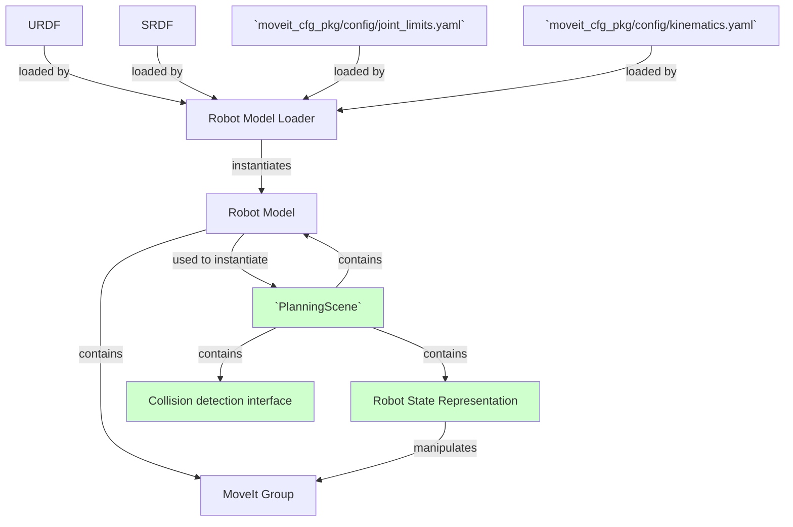
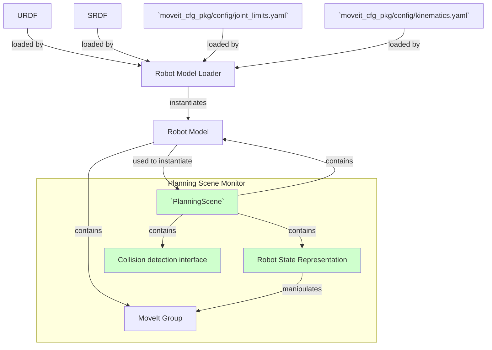

# Enviroment representation in MoveIt

| MoveIt concept | class | task |
| -------------- | ----- | ---- |
| Planninc Scene Manager |`planning_scene::PlanningScene`| Wraper for `RobotModel`, contains actual `Robotstate` and performs Colision detection|
| Collision request | `collision_detection::CollisionRequest` and `collision_detection::CollisionResult` | Specify the characteristic of the collision check request |
| Kinematic constraints |     `kinematic_constraints::KinematicConstraint` | Represents constrains (joint, DK, etc) that are used to define motion plans goals |
| Planning Scene Monitor | `planning_scene_monitor::PlannningSceneMonitor` | Wraper for `RobotModel`, `PlanningScene` and provides the infrastructore of subscriber and publishers|

## Planning Scene Manager (`planning_scene::PlanningScene`)

The planning scene `planning_scene::PlanningScene` is the central class for motion planning in MoveIt.
It is [declared here](https://github.com/ros-planning/moveit/blob/382aa5a8cdd39eace07536d39c497a4b21f0f653/moveit_core/planning_scene/include/moveit/planning_scene/planning_scene.h#L87) and [defined here](https://github.com/ros-planning/moveit/blob/master/moveit_core/planning_scene/src/planning_scene.cpp).
A planning scene represents all the information needed to compute motion plans: 

- The robot's current state
- its representation (geometric, kinematic, dynamic)
- the world representation.

Using this information, things like forward kinematics, inverse kinematics, evaluation of constraints, collision checking, are all possible.

The `planning_scene::PlanningScene` class is intended to be tightly connected to the `planning_scene_monitor::PlannningSceneMonitor` class, which maintains a planning scene using information from the ROS Parameter Server and subscription to topics.

The `PlanningScene` class provides the main interface that you will use for collision checking and constraint checking. 

This class maintains the representation of the environment as seen by a planning instance. The environment geometry, the robot geometry and state are maintained. 

The `PlanningScene` class can be easily setup and configured using a RobotModel or a URDF and SRDF.
This is, however, not the recommended way to instantiate a `PlanningScene`.
The `PlanningSceneMonitor` is the recommended method to create and maintain the current planning scene using data from the robot’s joints and the sensors on the robot.
In this tutorial, we will instantiate a `PlanningScene` class directly, but this method of instantiation is only intended for illustration.



## Planning Scene Monitor

`PlanningSceneMonitor` is [declared here](https://github.com/ros-planning/moveit/blob/47884198c2585215de8f365a7ff20479f8bb4b51/moveit_ros/planning/planning_scene_monitor/include/moveit/planning_scene_monitor/planning_scene_monitor.h#L61) and [defined here](https://github.com/ros-planning/moveit/blob/47884198c2585215de8f365a7ff20479f8bb4b51/moveit_ros/planning/planning_scene_monitor/src/planning_scene_monitor.cpp).
In its construction, this runs a `ros::AsyncSpinner`.

- **Function** `PlanningSceneMonitor::startSceneMonitor` by default it creates a subscriber to `planning_scene` with callback `PlanningSceneMonitor::newPlanningSceneCallback`

- **Function** `PlanningSceneMonitor::newPlanningSceneCallback`, just calls `PlanningSceneMonitor::newPlanningSceneMessage`

- **Function** `PlanningSceneMonitor::newPlanningSceneMessage`. Uses the tools from the package `moveit_ros_occupancy_map_monitor` and the class `occupancy_map_monitor::OccupancyMapMonitor` to update the scene.

- **Function** `PlanningSceneMonitor::startWorldGeometryMonitor` by default it creates a subscriber to `collision_object` with callback `PlanningSceneMonitor::collisionObjectCallback` and a subscriber to `planning_scene_world` with callback `PlanningSceneMonitor::newPlanningSceneWorldCallback`

- **Function** `PlanningSceneMonitor::collisionObjectCallback` 
- **Function** `PlanningSceneMonitor::newPlanningSceneWorldCallback` 


- **Subscribed topics**
    - `planning_scene` of type `moveit_msgs::PlanningScene` [declared here](http://docs.ros.org/en/api/moveit_msgs/html/msg/PlanningScene.html). Thus subscriber is instantiated at `PlanningSceneMonitor::startSceneMonitor`.
On this message the function `PlanningSceneMonitor::newPlanningSceneMessage` is called.
    - `collision_object` of type `moveit_msgs::CollisionObject` [declared here](http://docs.ros.org/en/jade/api/moveit_msgs/html/msg/CollisionObject.html) with callback `PlanningSceneMonitor::collisionObjectCallback`. This subscriber is instantiated at `PlanningSceneMonitor::startWorldGeometryMonitor`
    - `planning_scene_world` of type `moveit_msgs::PlanningScene` with callback `PlanningSceneMonitor::newPlanningSceneWorldCallback`.  This subscriber is instantiated at `PlanningSceneMonitor::startWorldGeometryMonitor`
    - `attached_collision_object` of type `moveit_msgs::AttachedCollisionObject` [declared here](http://docs.ros.org/en/jade/api/moveit_msgs/html/msg/AttachedCollisionObject.html) with callback `PlanningSceneMonitor::attachObjectCallback`
    - `joint_states` subscribed by `PlanningSceneMonitor::current_state_monitor_` of type `CurrentStateMonitorPtr` with callback `planning_scene_monitor::CurrentStateMonitor::jointStateCallback` [defined here](https://github.com/ros-planning/moveit/blob/382aa5a8cdd39eace07536d39c497a4b21f0f653/moveit_ros/planning/planning_scene_monitor/src/current_state_monitor.cpp#L336).

- **Published topics**
    - `monitored_planning_scene` of type `moveit_msgs::PlanningScene`.

- **Required services**
    - **Optional?** `get_planning_scene` of type `moveit_msgs::GetPlanningScene` [declared here](http://docs.ros.org/en/api/moveit_msgs/html/srv/GetPlanningScene.html).
This service is called by `PlanningSceneMonitor::requestPlanningSceneState`

- **Offered services**
    - **Optional?** `get_planning_scene`with callback `PlanningSceneMonitor::getPlanningSceneServiceCallback` optional service for getting the complete planning scene.
This is useful for satisfying the Rviz PlanningScene display's need for a service **without having to use a `move_group` node**.
 _Be careful not to use this in conjunction with `PlanningSceneMonitor::requestPlanningSceneState`_, as it will create a pointless feedback loop
This service is initiated by `PlanningSceneMonitor::providePlanningSceneService`

    - `tf2_frames` through `PlanningSceneMonitor::tf_buffer_`

    - ` `
- **Threads**
    - `PlanningSceneMonitor::scenePublishingThread` [defined here](https://github.com/ros-planning/moveit/blob/47884198c2585215de8f365a7ff20479f8bb4b51/moveit_ros/planning/planning_scene_monitor/src/planning_scene_monitor.cpp#L334)


- **Members**
    - `planning_scene::PlanningScenePtr scene_;` Argument of the constructor, by default `planning_scene::PlanningScenePtr()`
    - `std::shared_ptr<tf2_ros::Buffer> tf_buffer_;` (this type is [declared here](https://github.com/ros/geometry2/blob/ad04943f23608ab757389ce57d04f110df1c692b/tf2_ros/include/tf2_ros/buffer.h#L51) and [defined here](https://github.com/ros/geometry2/blob/ad04943f23608ab757389ce57d04f110df1c692b/tf2_ros/src/buffer.cpp)) Argument of the constructor, stores known frames.    tf2_ros::TransformListener
    - `std::unique_ptr<occupancy_map_monitor::OccupancyMapMonitor> octomap_monitor_;`
    - `robot_model_loader::RobotModelLoaderPtr rm_loader_;`, loads the model
    - `moveit::core::RobotModelConstPtr robot_model_;`
    - `collision_detection::CollisionPluginLoader collision_loader_;`
    - `DynamicReconfigureImpl* reconfigure_impl_;`


## Kinematic constraints

The base class for custon MoveIt constraints is `kinematic_constraints::KinematicConstraint` [defined here](https://github.com/ros-planning/moveit/blob/ff552bf861609f99ca97a7e173fcbeb0c03e9f45/moveit_core/kinematic_constraints/include/moveit/kinematic_constraints/kinematic_constraint.h#L78) and [implemented here](https://github.com/ros-planning/moveit/blob/ff552bf861609f99ca97a7e173fcbeb0c03e9f45/moveit_core/kinematic_constraints/src/kinematic_constraint.cpp#L61).
- `kinematic_constraints::JointConstraint`
- `kinematic_constraints::PositionConstraint`
- `kinematic_constraints::OrientationConstraint`
- `kinematic_constraints::VisibilityConstraint`


The Ros message `moveit_msgs::Constraints`is [defined here](https://github.com/ros-planning/moveit_msgs/blob/melodic-devel/msg/Constraints.msg).
- `name` of type `string` 
- `joint_constraints` of type `JointConstraint[]` 
- `position_constraints` of type `PositionConstraint[]` 
    - `header` of type `Header`
    - `link_name` of type `string`
    - `target_point_offset` of type `geometry_msgs/Vector3`
    - `constraint_region` of type `BoundingVolume`
    - `weigh` of type `float64`
- `orientation_constraints` of type `OrientationConstraint[]` 
    - `header` of type `Header`
    - `orientation` of type `geometry_msgs/Quaternion`
    - `link_name` of type `string`
    - `absolute_x_axis_tolerance` of type `float64`
    - `absolute_y_axis_tolerance` of type `float64`
    - `absolute_z_axis_tolerance` of type `float64`
    - `weight` of type `float64`
- `visibility_constraints` of type `VisibilityConstraint[]`

The `moveit_msgs::BoundingVolume`
- `primitives` of type `shape_msgs/SolidPrimitive[]`
- `primitive_poses` of type `geometry_msgs/Pose[]`
- `meshes` of type `shape_msgs/Mesh[]`
- `mesh_poses` of type `geometry_msgs/Pose[]`
## The `apply_planning_scene` service

The class `PlannningSceneMonitor` does not provide by default a service to modify the planning scene.
By default, moveit provide such a service inside the `move_group` node.
We implement this service using the same mechanism, with the following service
```C++
bool apply_planning_scene(moveit_msgs::ApplyPlanningScene::Request &req,
                          moveit_msgs::ApplyPlanningScene::Response &res) {
    // psm is the PlannningSceneMonitor
  psm->updateFrameTransforms();
  res.success = psm->newPlanningSceneMessage(req.scene);
  return true;
}
```

The `PlannningSceneMonitor::newPlanningSceneMessage` is [defined here](https://github.com/ros-planning/moveit/blob/701fbddb26f5aa4e752235b893292fc4618da135/moveit_ros/planning/planning_scene_monitor/src/planning_scene_monitor.cpp#L554).
This function updates a series of attributes of `PlannningSceneMonitor` and calls the function `PlanningScene::usePlanningSceneMsg` [defined here](https://github.com/ros-planning/moveit/blob/bdd4bde4938c7bdac3a57a791cf738146c8834e0/moveit_core/planning_scene/src/planning_scene.cpp#L1266).
