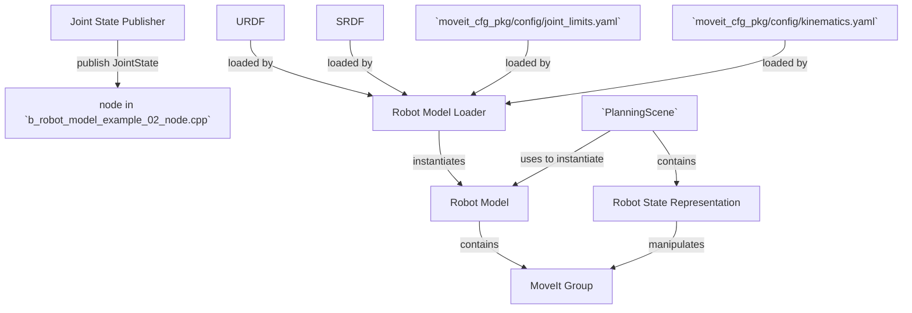

# Planning Scene Example 01: How to use `planning_scene::PlanningScene` for collision detection

This example intends to create an instance of a `planning_scene::PlanningScene` with the minimum required set-up and use it for collision detection. 

The planning scene class `planning_scene::PlanningScene` is the central class for motion planning in MoveIt.
It is [defined here](https://github.com/ros-planning/moveit/blob/melodic-devel/moveit_core/planning_scene/include/moveit/planning_scene/planning_scene.h#L86) and [implemented here](https://github.com/ros-planning/moveit/blob/melodic-devel/moveit_core/planning_scene/src/planning_scene.cpp).
A planning scene represents all the information needed to compute motion plans: 

- The robot's workspace model `RobotModel`
- its geometric, kinematic or dynamic representation `RobotState`
- The collision detector `collision_detection::CollisionDetector` and constraint checking

In practice `planning_scene::PlanningScene` is a convince wrapper for the `RobotModel` and a collision checker.
We can use any collision checker with a MoveIt plugin interface.
By default `planning_scene::PlanningScene` instantiates a FCL collision checker.

The `planning_scene::PlanningScene` class is tightly connected to the `planning_scene_monitor::PlannningSceneMonitor` class, which maintains a planning scene using information from the ROS Parameter Server and subscription to topics.
**The `PlanningSceneMonitor` is the recommended method to create and maintain the current planning scene using data from the robot’s joints and the sensors on the robot**.

## What do we do with `PlanningScene`

We use `PlanningScene` only for collision detection.
1. As a container for a `RobotState` which represents the current state of the robot in the workspace
2. As an interface to the collision detectin system (FCL)



# Parameters required by the Planning Scene instance

We need several parameters that are automatically generated by the moveit assistance when it creates the moveit configuration package.
These parameters must be loaded in the correct name space

- **Joint limits for each joint** (available in `MOVEITCONFIGPACKAGE/config/joint_limits.yaml`)
    - `robot_description_planning/joint_limits/JOINT_NAME/has_velocity_limits`
    - `robot_description_planning/joint_limits/JOINT_NAME/max_velocity`
    - `robot_description_planning/joint_limits/JOINT_NAME/has_acceleration_limits` 
    - `robot_description_planning/joint_limits/JOINT_NAME/max_acceleration`

- **kinematic solver details for each planning group** (available in `MOVEITCONFIGPACKAGE/config/joint_limits.yaml`)
    - `PLANNINGGROUP/kinematics_solver` (e.g. `kdl_kinematics_plugin/KDLKinematicsPlugin`)
    - `PLANNINGGROUP/kinematics_solver_search_resolution` 
    - `PLANNINGGROUP/kinematics_solver_timeout` 
- **robot description** `robot_description` (URDF description)
- **robot semantic description** `robot_description_semantic` (available at `MOVEITCONFIGPACKAGE/config/myrobot.srdf`>

In general the following preamble should be sufficient
```XML
  <param name="robot_description" command="$(find xacro)/xacro --inorder '$(find workspace_description)/urdf/robot.xacro'"/>
  <param name="robot_description_semantic" command="cat $(find myrobot_config_package)/config/myrobot.srdf"/>
  <group ns="robot_description_planning">
    <rosparam command="load" file="$(find myrobot_config_package)/config/joint_limits.yaml"/>
  </group>
  <group ns="robot_description_kinematics">
    <rosparam command="load" file="$(find myrobot_config_package)/config/kinematics.yaml"/>
  </group>
```

# What does this example do?

In this example we instantiate a `PlanningScene` with the robot and workspace defined in this repository in `/common_packages`.
Then, we use the this `PlanningScene` instance to check the collisions of the robot with itself and the environment.
The example runs an `rviz` instance where the configuration of the robot is shown.
The example also prints information about the collision for each configuration.

## The launch file

1. Set up parameters
2. Launch a `joint_state_publisher` which repeats the state of the robot.
3. Launch a `robot_state_publisher`
4. Launch the node
5. Launch Rviz

## The node code
1. **Initialization of the ros node**
2. **Initializatio of the MoveIt robot model and the planning scene**
```C++
  robot_model_loader::RobotModelLoader robot_model_loader("robot_description");
  robot_model::RobotModelPtr my_robot_model = robot_model_loader.getModel();
  planning_scene::PlanningScene planning_scene(my_robot_model);
```
3. **Initialization of the input and output of the collision detector** and require to return the links in collision. We also set a maximum number of objects in collision
```C++
  collision_detection::CollisionRequest collision_request;
  collision_request.contacts = true;
  collision_request.max_contacts = 1000;
  collision_detection::CollisionResult collision_result;
```
4. **While the node is running**
    1. **Get the actual instance of the robot state** (This is required because the state may change) **and the jointgroup for planning**
    ```C++
        robot_state::RobotState& kinematic_model_actual = planning_scene.getCurrentStateNonConst();
        const robot_model::JointModelGroup* joint_group = kinematic_model_actual.getJointModelGroup("myrobotplanninggroup");
    ```
    2. **Reset the collision request**
    ```C++
        collision_request.group_name = "myrobotplanninggroup";
        collision_result.clear();
    ```
    3. **Set the robot in a random configuration**
    ```C++
        kinematic_model_actual.setToRandomPositions(joint_group);
    ```
    4. **call the collision checker**
    ```C++
        planning_scene.checkSelfCollision(collision_request, collision_result);
    ```
    5. **If there are collisions then print the links that are colliding**
    ```C++
      collision_detection::CollisionResult::ContactMap::const_iterator it;
      for (it = collision_result.contacts.begin(); it != collision_result.contacts.end(); ++it)
        ROS_INFO("    Contact between: %s and %s", it->first.first.c_str(), it->first.second.c_str());
    ```
# How did we create this package?

1. Create the catkin package
```CMake
catkin create pkg PROJECT_NAME --catkin-deps roscpp moveit_core moveit_ros_planning_interface --system-deps Eigen3
```

2. In `CMakeLists.txt` add the executable indicated name of the executable and source file with `main`
```CMake
add_executable(${PROJECT_NAME}_node src/SOURCE.cpp)
```
3. In `CMakeLists.txt` add the libraries to link against
```CMake
target_link_libraries(${PROJECT_NAME}_node
  ${catkin_LIBRARIES}
  ${Eigen3_LIBRARIES}
)
```
## How to instantiate a Planning Scene in detail

To construct a MoveIt planning scene we need only a MoveIt robot model.
It follows that the `planning_scene::PlanningScene` class can be constructed with a `robot_model::RobotModel` or the info to construc the robot model.

- The constructor has two signatures

    - construct using an existing RobotModel 
    ```
        PlanningScene(
          const robot_model::RobotModelConstPtr& robot_model,
          const collision_detection::WorldPtr& world = collision_detection::WorldPtr(new collision_detection::World()));
    ```

    - construct using a urdf and srdf.
    ```
      PlanningScene(
          const urdf::ModelInterfaceSharedPtr& urdf_model, const srdf::ModelConstSharedPtr& srdf_model,
          const collision_detection::WorldPtr& world = collision_detection::WorldPtr(new collision_detection::World()));
    ``` 

The `planning_scene::PlanningScene` constructor is mostly impleented in `PlanningScene::initialize`.
From that method other methods are caled. The code in each funcion involved in the construcot is more or less this
- In `PlanningScene::initialize` we have
    ```
      // 1) Set up a wraper for all the transofrms of this PlanningScene instance
      scene_transforms_.reset(new SceneTransforms(this));
      // 2) initialize the kinematic model RobotState
      robot_state_.reset(new robot_state::RobotState(robot_model_));
      robot_state_->setToDefaultValues();
      robot_state_->update();

      // 3) initialize the member `collision_detection::AllowedCollisionMatrixPtr acm_`
      acm_.reset(new collision_detection::AllowedCollisionMatrix());
      // ...
      setActiveCollisionDetector(collision_detection::CollisionDetectorAllocatorFCL::create(), exclusive=false);
    ```

- The method `setActiveCollisionDetector` has two signatures. The one called in `PlanningScene::initialize` has the local variable `exclusive` as `exclusive=flase` and does the following
    ```
        allocator= collision_detection::CollisionDetectorAllocatorFCL::create() // argument of the function
        addCollisionDetector(allocator); // initializes the CollisionDetector members of collision_ with the collision detecor FCL features
        setActiveCollisionDetector(allocator->getName()); // set active_collision_ with the FLC collision detector
    ```
- The method `addCollisionDetector` initiates `collision_` and eventually add a new entry to handle the desired collision detector with the private class `CollisionDetector`.
- The `setActiveCollisionDetector` with the string argument just set the variable `active_collision_`


## Classes used by `PlanningScene`

- **Members**
    - `std::string name_;`
    - `PlanningSceneConstPtr parent_;` used wth diff scene.
    - `robot_model::RobotModelConstPtr robot_model_;`
    - `robot_state::RobotStatePtr robot_state_;`
    - `robot_state::AttachedBodyCallback current_state_attached_body_callback_;`
    - `robot_state::TransformsPtr scene_transforms_;`
    - `collision_detection::WorldPtr world_`
    - `collision_detection::WorldConstPtr world_const_`
    - `collision_detection::WorldDiffPtr world_diff_`
    - `collision_detection::World::ObserverCallbackFn current_world_object_update_callback_`
    - `collision_detection::World::ObserverHandle current_world_object_update_observer_handle_`
    - `std::map<std::string, CollisionDetectorPtr> collision_`
    - `CollisionDetector Ptr active_collision_`
    - `collision_detection::AllowedCollisionMatrixPtr acm_`
    - `StateFeasibilityFn state_feasibility_`
    - `MotionFeasibilityFn motion_feasibility_`
    - `std::unique_ptr<ObjectColorMap> object_colors_`
    - `std::unique_ptr<ObjectTypeMap> object_types_`

- **other used classes**
    - `planning_scene::PlanningScene::CollisionDetector` [defined here](https://github.com/ros-planning/moveit/blob/ff552bf861609f99ca97a7e173fcbeb0c03e9f45/moveit_core/planning_scene/include/moveit/planning_scene/planning_scene.h#L987) wraps a set of compatible collision detectors. This is a private class os `PlanningScene` and is used in the membmer `std::map<std::string, CollisionDetectorPtr> collision_;` and `active_collision_`.
    - `collision_detection::World` [defined here](https://github.com/ros-planning/moveit/blob/melodic-devel/moveit_core/collision_detection/include/moveit/collision_detection/world.h) and [implemented here](https://github.com/ros-planning/moveit/blob/melodic-devel/moveit_core/collision_detection/src/world.cpp).
    - `moveit::core::Transforms` [defined here](https://github.com/ros-planning/moveit/blob/ff552bf861609f99ca97a7e173fcbeb0c03e9f45/moveit_core/transforms/include/moveit/transforms/transforms.h#L60) and [implemented here](https://github.com/ros-planning/moveit/blob/melodic-devel/moveit_core/transforms/src/transforms.cpp) Provides an implementation of a snapshot of a transform tree that can be easily queried for
    transforming different quantities. Transforms are maintained as a list of transforms to a particular frame.
    All stored transforms are considered fixed.
    - `SceneTransforms` [locally defined and implemented here](https://github.com/ros-planning/moveit/blob/ff552bf861609f99ca97a7e173fcbeb0c03e9f45/moveit_core/planning_scene/src/planning_scene.cpp#L58). Inherits from `moveit::core::Transforms`. It has a simple constructor 
    ```
    SceneTransforms(const PlanningScene* scene) : Transforms(scene->getRobotModel()->getModelFrame()), scene_(scene)
    {
    }
    ```
    This class wraps all the transforms of the PlanningScene.
    - `colision_detection::CollisionDetectorAllocatorTemplate `[defined here](https://github.com/ros-planning/moveit/blob/ff552bf861609f99ca97a7e173fcbeb0c03e9f45/moveit_core/collision_detection/include/moveit/collision_detection/collision_detector_allocator.h#L75) implementes `static CollisionDetectorAllocatorPtr create()`
    ```
    class CollisionDetectorAllocatorFCL
    : public CollisionDetectorAllocatorTemplate<CollisionWorldFCL, CollisionRobotFCL, CollisionDetectorAllocatorFCL>
    ```


## Checking for collisions in detail

The main signture of `checkSelfCollision` [is here](https://github.com/ros-planning/moveit/blob/ff552bf861609f99ca97a7e173fcbeb0c03e9f45/moveit_core/planning_scene/include/moveit/planning_scene/planning_scene.h#L496)
```
void checkSelfCollision(const collision_detection::CollisionRequest& req, collision_detection::CollisionResult& res,
                          const robot_state::RobotState& robot_state) const
  {
    // do self-collision checking with the unpadded version of the robot
    getCollisionRobotUnpadded()->checkSelfCollision(req, res, robot_state, getAllowedCollisionMatrix());
  }
```

```
  const collision_detection::CollisionRobotConstPtr& getCollisionRobotUnpadded() const
  {
      // this is equivalent to detector_->alloc_->allocateRobot(getRobotModel())
    return active_collision_->getCollisionRobotUnpadded();
  }
```
The function `PlanningScene::CollisionDetector::getCollisionRobotUnpadded` is [defined here](https://github.com/ros-planning/moveit/blob/ff552bf861609f99ca97a7e173fcbeb0c03e9f45/moveit_core/planning_scene/include/moveit/planning_scene/planning_scene.h#L1004).
The function `colision_detection::CollisionDetectorAllocator::allocateRobot`[is defined here as a pure virtual function](https://github.com/ros-planning/moveit/blob/ff552bf861609f99ca97a7e173fcbeb0c03e9f45/moveit_core/collision_detection/include/moveit/collision_detection/collision_detector_allocator.h#L68) and is available in `lib/libcollision_detector_fcl_plugin.so`.

**To check a self collision we need**
- `collision_detection::CollisionRequest` a simple struct [defined and implemented here](https://github.com/ros-planning/moveit/blob/ff552bf861609f99ca97a7e173fcbeb0c03e9f45/moveit_core/collision_detection/include/moveit/collision_detection/collision_common.h#L173)
    - `std::string group_name;` (default `""`) The group name to check collisions for. This is optional; if empty, assume the complete robot
    - `bool distance;` (default `false`) If true, compute proximity distance 
    - `bool cost;` (default `false`) If true, a collision cost is computed 
    - `bool contacts;` (default `1`) If true, compute contacts. Otherwise only a binary collision yes/no is reported. 
    - `std::size_t max_contacts;` (default `1`) Overall maximum number of contacts to compute 
    - `std::size_t max_contacts_per_pair;` (default `1`) Maximum number of contacts to compute per pair of bodies (multiple bodies may be in contact at different configurations)
    - `std::size_t max_cost_sources;` (default `1`) When costs are computed, this value defines how many of the top cost sources should be returned 
    - `double min_cost_density;` (default `0.2`) When costs are computed, this is the minimum cost density for a CostSource to be included in the results 
    - `bool verbose;` (default `false`) Flag indicating whether information about detected collisions should be reported 

- `collision_detection::CollisionResult` a simple string [defined and implemented here](https://github.com/ros-planning/moveit/blob/ff552bf861609f99ca97a7e173fcbeb0c03e9f45/moveit_core/collision_detection/include/moveit/collision_detection/collision_common.h#L137)
    - `clear` clear the value of the collision request.
    ```
    collision = false;
    distance = std::numeric_limits<double>::max();
    contact_count = 0;
    contacts.clear();
    cost_sources.clear();
    ```
    - `bool collision;` True if collision was found, false otherwise 
    - `double distance;` Closest distance between two bodies 
    - `std::size_t contact_count;` Number of contacts returned 
    - `ContactMap contacts;`  A map returning the pairs of body ids in contact, plus their contact details 
    - `std::set<CostSource> cost_sources;` These are the individual cost sources when costs are computed 
- `moveit::core::RobotState` the model of the world. This parameters remains internal to the `PlanningScene`


   The first thing we will do is check whether the robot in its current state is in *self-collision*, i.e. whether the current configuration of the robot would result in the robot's parts hitting each other.
To do this, we will construct a :`collision_detection_struct::CollisionRequest` object and a `collision_detection_struct::CollisionResult` object and pass them into the collision checking function.
Note that the result of whether the robot is in self-collision or not is contained within the result.
Self collision checking uses an *unpadded* version of the robot, i.e. it directly uses the collision meshes provided in the URDF with no extra padding added on.
