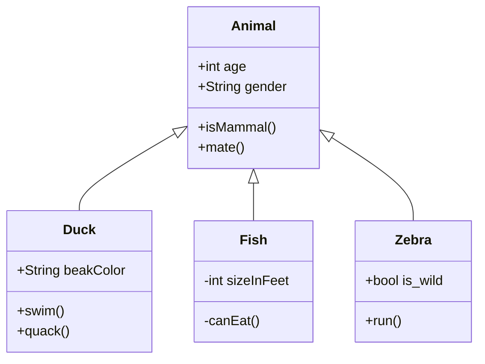

# Planning Scene Example 01

The planning scene class `planning_scene::PlanningScene` is the central class for motion planning in MoveIt.
It is [defined here](https://github.com/ros-planning/moveit/blob/melodic-devel/moveit_core/planning_scene/include/moveit/planning_scene/planning_scene.h#L86) and [implemented here](https://github.com/ros-planning/moveit/blob/melodic-devel/moveit_core/planning_scene/src/planning_scene.cpp).
A planning scene represents all the information needed to compute motion plans: 

    - The robot's workspace model `RobotModel`
    - its geometric, kinematic or dynamic representation `RobotState`
    - The collision detector `collision_detection::CollisionDetector`




Using this information, things like forward kinematics, inverse kinematics, evaluation of constraints, collision checking, are all possible.

The `planning_scene::PlanningScene` class is tightly connected to the `planning_scene_monitor::PlannningSceneMonitor` class, which maintains a planning scene using information from the ROS Parameter Server and subscription to topics.

The `PlanningScene` class provides the main interface that you will use for collision checking and constraint checking. 

This class maintains the representation of the environment as seen by a planning instance. 
The environment geometry, the robot geometry and state are maintained. 

The `PlanningScene` class can be easily setup and configured using a RobotModel or a URDF and SRDF.
This is, however, not the recommended way to instantiate a `PlanningScene`.
The `PlanningSceneMonitor` is the recommended method to create and maintain the current planning scene using data from the robot’s joints and the sensors on the robot.
In this tutorial, we will instantiate a `PlanningScene` class directly, but this method of instantiation is only intended for illustration.

## How to instantiate a Planning Scene

To construct a MoveIt planning scence only a MoveIt robot model is required.
It follows that the `planning_scene::PlanningScene` class can be constructed with a `robot_model::RobotModel` or the info to construc the robot model.

- The constructor has two signatures

    - construct using an existing RobotModel 
    ```
        PlanningScene(
          const robot_model::RobotModelConstPtr& robot_model,
          const collision_detection::WorldPtr& world = collision_detection::WorldPtr(new collision_detection::World()));
    ```

    - construct using a urdf and srdf.
    ```
      PlanningScene(
          const urdf::ModelInterfaceSharedPtr& urdf_model, const srdf::ModelConstSharedPtr& srdf_model,
          const collision_detection::WorldPtr& world = collision_detection::WorldPtr(new collision_detection::World()));
    ``` 

The `planning_scene::PlanningScene` constructor is mostly impleented in `PlanningScene::initialize`.
From that method other methods are caled. The code in each funcion involved in the construcot is more or less this
- In `PlanningScene::initialize` we have
    ```
      // 1) Set up a wraper for all the transofrms of this PlanningScene instance
      scene_transforms_.reset(new SceneTransforms(this));
      // 2) initialize the kinematic model RobotState
      robot_state_.reset(new robot_state::RobotState(robot_model_));
      robot_state_->setToDefaultValues();
      robot_state_->update();

      // 3) initialize the member `collision_detection::AllowedCollisionMatrixPtr acm_`
      acm_.reset(new collision_detection::AllowedCollisionMatrix());
      // ...
      setActiveCollisionDetector(collision_detection::CollisionDetectorAllocatorFCL::create(), exclusive=false);
    ```

- The method `setActiveCollisionDetector` has two signatures. The one called in `PlanningScene::initialize` has the local variable `exclusive` as `exclusive=flase` and does the following
    ```
        allocator= collision_detection::CollisionDetectorAllocatorFCL::create() // argument of the function
        addCollisionDetector(allocator); // initializes the CollisionDetector members of collision_ with the collision detecor FCL features
        setActiveCollisionDetector(allocator->getName()); // set active_collision_ with the FLC collision detector
    ```
- The method `addCollisionDetector` initiates `collision_` and eventually add a new entry to handle the desired collision detector with the private class `CollisionDetector`.
- The `setActiveCollisionDetector` with the string argument just set the variable `active_collision_`


## Used classes

- **Members**
    - `std::string name_;`
    - `PlanningSceneConstPtr parent_;` used wth diff scene.
    - `robot_model::RobotModelConstPtr robot_model_;`
    - `robot_state::RobotStatePtr robot_state_;`
    - `robot_state::AttachedBodyCallback current_state_attached_body_callback_;`
    - `robot_state::TransformsPtr scene_transforms_;`
    - `collision_detection::WorldPtr world_`
    - `collision_detection::WorldConstPtr world_const_`
    - `collision_detection::WorldDiffPtr world_diff_`
    - `collision_detection::World::ObserverCallbackFn current_world_object_update_callback_`
    - `collision_detection::World::ObserverHandle current_world_object_update_observer_handle_`
    - `std::map<std::string, CollisionDetectorPtr> collision_`
    - `CollisionDetector Ptr active_collision_`
    - `collision_detection::AllowedCollisionMatrixPtr acm_`
    - `StateFeasibilityFn state_feasibility_`
    - `MotionFeasibilityFn motion_feasibility_`
    - `std::unique_ptr<ObjectColorMap> object_colors_`
    - `std::unique_ptr<ObjectTypeMap> object_types_`

- **other used classes**
    - `planning_scene::PlanningScene::CollisionDetector` [defined here](https://github.com/ros-planning/moveit/blob/ff552bf861609f99ca97a7e173fcbeb0c03e9f45/moveit_core/planning_scene/include/moveit/planning_scene/planning_scene.h#L987) wraps a set of compatible collision detectors. This is a private class os `PlanningScene` and is used in the membmer `std::map<std::string, CollisionDetectorPtr> collision_;` and `active_collision_`.
    - `collision_detection::World` [defined here](https://github.com/ros-planning/moveit/blob/melodic-devel/moveit_core/collision_detection/include/moveit/collision_detection/world.h) and [implemented here](https://github.com/ros-planning/moveit/blob/melodic-devel/moveit_core/collision_detection/src/world.cpp).
    - `moveit::core::Transforms` [defined here](https://github.com/ros-planning/moveit/blob/ff552bf861609f99ca97a7e173fcbeb0c03e9f45/moveit_core/transforms/include/moveit/transforms/transforms.h#L60) and [implemented here](https://github.com/ros-planning/moveit/blob/melodic-devel/moveit_core/transforms/src/transforms.cpp) Provides an implementation of a snapshot of a transform tree that can be easily queried for
    transforming different quantities. Transforms are maintained as a list of transforms to a particular frame.
    All stored transforms are considered fixed.
    - `SceneTransforms` [locally defined and implemented here](https://github.com/ros-planning/moveit/blob/ff552bf861609f99ca97a7e173fcbeb0c03e9f45/moveit_core/planning_scene/src/planning_scene.cpp#L58). Inherits from `moveit::core::Transforms`. It has a simple constructor 
    ```
    SceneTransforms(const PlanningScene* scene) : Transforms(scene->getRobotModel()->getModelFrame()), scene_(scene)
    {
    }
    ```
    This class wraps all the transforms of the PlanningScene.
    - `colision_detection::CollisionDetectorAllocatorTemplate `[defined here](https://github.com/ros-planning/moveit/blob/ff552bf861609f99ca97a7e173fcbeb0c03e9f45/moveit_core/collision_detection/include/moveit/collision_detection/collision_detector_allocator.h#L75) implementes `static CollisionDetectorAllocatorPtr create()`
    ```
    class CollisionDetectorAllocatorFCL
    : public CollisionDetectorAllocatorTemplate<CollisionWorldFCL, CollisionRobotFCL, CollisionDetectorAllocatorFCL>
    ```


## Checking for collisions

The main signture of `checkSelfCollision` [is here](https://github.com/ros-planning/moveit/blob/ff552bf861609f99ca97a7e173fcbeb0c03e9f45/moveit_core/planning_scene/include/moveit/planning_scene/planning_scene.h#L496)
```
void checkSelfCollision(const collision_detection::CollisionRequest& req, collision_detection::CollisionResult& res,
                          const robot_state::RobotState& robot_state) const
  {
    // do self-collision checking with the unpadded version of the robot
    getCollisionRobotUnpadded()->checkSelfCollision(req, res, robot_state, getAllowedCollisionMatrix());
  }
```

```
  const collision_detection::CollisionRobotConstPtr& getCollisionRobotUnpadded() const
  {
      // this is equivalent to detector_->alloc_->allocateRobot(getRobotModel())
    return active_collision_->getCollisionRobotUnpadded();
  }
```
The function `PlanningScene::CollisionDetector::getCollisionRobotUnpadded` is [defined here](https://github.com/ros-planning/moveit/blob/ff552bf861609f99ca97a7e173fcbeb0c03e9f45/moveit_core/planning_scene/include/moveit/planning_scene/planning_scene.h#L1004).
The function `colision_detection::CollisionDetectorAllocator::allocateRobot`[is defined here as a pure virtual function](https://github.com/ros-planning/moveit/blob/ff552bf861609f99ca97a7e173fcbeb0c03e9f45/moveit_core/collision_detection/include/moveit/collision_detection/collision_detector_allocator.h#L68) and is available in `lib/libcollision_detector_fcl_plugin.so`.

**To check a self collision we need**
- `collision_detection::CollisionRequest` a simple struct [defined and implemented here](https://github.com/ros-planning/moveit/blob/ff552bf861609f99ca97a7e173fcbeb0c03e9f45/moveit_core/collision_detection/include/moveit/collision_detection/collision_common.h#L173)
    - `std::string group_name;` (default `""`) The group name to check collisions for. This is optional; if empty, assume the complete robot
    - `bool distance;` (default `false`) If true, compute proximity distance 
    - `bool cost;` (default `false`) If true, a collision cost is computed 
    - `bool contacts;` (default `1`) If true, compute contacts. Otherwise only a binary collision yes/no is reported. 
    - `std::size_t max_contacts;` (default `1`) Overall maximum number of contacts to compute 
    - `std::size_t max_contacts_per_pair;` (default `1`) Maximum number of contacts to compute per pair of bodies (multiple bodies may be in contact at different configurations)
    - `std::size_t max_cost_sources;` (default `1`) When costs are computed, this value defines how many of the top cost sources should be returned 
    - `double min_cost_density;` (default `0.2`) When costs are computed, this is the minimum cost density for a CostSource to be included in the results 
    - `bool verbose;` (default `false`) Flag indicating whether information about detected collisions should be reported 

- `collision_detection::CollisionResult` a simple string [defined and implemented here](https://github.com/ros-planning/moveit/blob/ff552bf861609f99ca97a7e173fcbeb0c03e9f45/moveit_core/collision_detection/include/moveit/collision_detection/collision_common.h#L137)
    - `clear` clear the value of the collision request.
    ```
    collision = false;
    distance = std::numeric_limits<double>::max();
    contact_count = 0;
    contacts.clear();
    cost_sources.clear();
    ```
    - `bool collision;` True if collision was found, false otherwise 
    - `double distance;` Closest distance between two bodies 
    - `std::size_t contact_count;` Number of contacts returned 
    - `ContactMap contacts;`  A map returning the pairs of body ids in contact, plus their contact details 
    - `std::set<CostSource> cost_sources;` These are the individual cost sources when costs are computed 
- `moveit::core::RobotState` the model of the world. This parameters remains internal to the `PlanningScene`


   The first thing we will do is check whether the robot in its current state is in *self-collision*, i.e. whether the current configuration of the robot would result in the robot's parts hitting each other.
To do this, we will construct a :`collision_detection_struct::CollisionRequest` object and a `collision_detection_struct::CollisionResult` object and pass them into the collision checking function.
Note that the result of whether the robot is in self-collision or not is contained within the result.
Self collision checking uses an *unpadded* version of the robot, i.e. it directly uses the collision meshes provided in the URDF with no extra padding added on.
