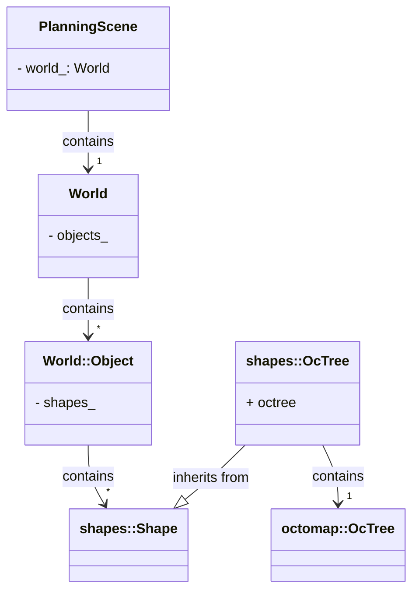

## create the package
`catkin create pkg d_octomap_monitor --catkin-deps roscpp moveit_core moveit_ros_planning_interface --system-deps Eigen3`


- The planning scene monitor declares the octopam [here](https://github.com/ros-planning/moveit/blob/9cc7e8fb0d5b9ceb09d5ba68b524e7a4ab7ca02f/moveit_ros/planning/planning_scene_monitor/include/moveit/planning_scene_monitor/planning_scene_monitor.h#L514) and binds it to the planning scene [here](https://github.com/ros-planning/moveit/blob/9cc7e8fb0d5b9ceb09d5ba68b524e7a4ab7ca02f/moveit_ros/planning/planning_scene_monitor/src/planning_scene_monitor.cpp#LL1251C15-L1251C32) and are added to the collision object world [here](https://github.com/ros-planning/moveit/blob/9cc7e8fb0d5b9ceb09d5ba68b524e7a4ab7ca02f/moveit_core/planning_scene/src/planning_scene.cpp#L1466).

- **The id of the octomap in the collision matrix is** `<octomap>`.

## `Octomap Shape`

[Declared here](https://github.com/ros-planning/geometric_shapes/blob/d338f9e87b92b548dbcccffce8c7997eed3ce2e1/include/geometric_shapes/shapes.h#L385) is stored in [`World::Object`](https://github.com/ros-planning/moveit/blob/5b430a3d66aec0543d77a0963b0e3b537c4a42be/moveit_core/collision_detection/include/moveit/collision_detection/world.h#L79) [here](https://github.com/ros-planning/moveit/blob/5b430a3d66aec0543d77a0963b0e3b537c4a42be/moveit_core/collision_detection/include/moveit/collision_detection/world.h#L97). Objects in `World` are [`World::objects_`](https://github.com/ros-planning/moveit/blob/5b430a3d66aec0543d77a0963b0e3b537c4a42be/moveit_core/collision_detection/include/moveit/collision_detection/world.h#L337).




## `OccupancyMapMonitor`

The OccupancyMapMonitor ( [Declared here](https://github.com/ros-planning/moveit/blob/9cc7e8fb0d5b9ceb09d5ba68b524e7a4ab7ca02f/moveit_ros/occupancy_map_monitor/include/moveit/occupancy_map_monitor/occupancy_map_monitor.h#L56) and [defined here](https://github.com/ros-planning/moveit/blob/9cc7e8fb0d5b9ceb09d5ba68b524e7a4ab7ca02f/moveit_ros/occupancy_map_monitor/src/occupancy_map_monitor.cpp#L48) )  class encapsulates the functionality related to storing, updating and performing collision dection with an octo-tree occupacy map.

- **Octo-tree storing** The octo-tree handled by this class is implemented as an [`collision_detection::OccMapTree`](/https://github.com/ros-planning/moveit/blob/8f67bb3ba0319391cb16ec7b524c03445f3b0c59/moveit_core/collision_detection/include/moveit/collision_detection/occupancy_map.h#L49) in the variable `OccupancyMapMonitor::tree_`which is an implementation of [`octomap::Octree`](https://github.com/OctoMap/octomap/blob/8178b4f28c72a8c7b84ece25bda7a59df8d14eb8/octomap/include/octomap/OcTree.h#L49).

- **Octo-tree updtaing and sensor integration** `OccupancyMapMonitor` relies on the class [`OccupancyMapUpdater`](https://github.com/ros-planning/moveit/blob/8f67bb3ba0319391cb16ec7b524c03445f3b0c59/moveit_ros/occupancy_map_monitor/include/moveit/occupancy_map_monitor/occupancy_map_updater.h#L58) ([defined here](https://github.com/ros-planning/moveit/blob/60bce92f6742cfd4853cf5bbcda4b24a80bc4cf5/moveit_ros/occupancy_map_monitor/src/occupancy_map_updater.cpp#L44)) to update the value of `OccupancyMapMonitor::tree_`. The `OccupancyMapUpdater` is a pluging class in which is instantiated [in the `OccupancyMapMonitor::initialize` method](https://github.com/ros-planning/moveit/blob/a2911c80c28958c1fce8fb52333d770248c4ec05/moveit_ros/occupancy_map_monitor/src/occupancy_map_monitor.cpp#L148). During the normal utilization of `move_group` the specific details of each octomap updateds are taken from the parameter `sensor_plugin`.

- **Collision checking**


Collision checking is a critical capability of the OccupancyMapMonitor. It provides methods to the motion planner that utilize the occupancy map to determine whether a given trajectory or robot configuration would result in collisions with obstacles. These methods involve efficient indexing and lookup operations on the occupancy map to check for occupancy probabilities in the vicinity of the robot's planned path.

Additionally, the OccupancyMapMonitor handles dynamic objects in the environment. It may include methods for updating the occupancy map to account for moving obstacles or objects that appear or disappear over time. These methods ensure that the occupancy map accurately reflects the evolving environment and enables collision checking to consider dynamic elements.

For debugging and monitoring purposes, the OccupancyMapMonitor may provide visualization capabilities. It might offer functions to generate visual representations of the occupancy map, allowing experts to visualize the map's content and observe occupied and free areas.

By meticulously understanding the C++ code implementation of the OccupancyMapMonitor, MoveIt experts can analyze and modify its behavior, optimize its performance, or extend its capabilities to cater to specific motion planning requirements.

### ROS API

| Service Name | Method |
| -----------  | -----  |
| `"save_map"` | [`OccupayMapMonitor::saveMapCallback`](https://github.com/ros-planning/moveit/blob/9cc7e8fb0d5b9ceb09d5ba68b524e7a4ab7ca02f/moveit_ros/occupancy_map_monitor/src/occupancy_map_monitor.cpp#L314) |
| `"load_map"` | [`OccupayMapMonitor::loadMapCallback`](https://github.com/ros-planning/moveit/blob/9cc7e8fb0d5b9ceb09d5ba68b524e7a4ab7ca02f/moveit_ros/occupancy_map_monitor/src/occupancy_map_monitor.cpp#L331) |

## `OccupancyMapUpdater`


[Declared here](https://github.com/ros-planning/moveit/blob/9cc7e8fb0d5b9ceb09d5ba68b524e7a4ab7ca02f/moveit_ros/occupancy_map_monitor/include/moveit/occupancy_map_monitor/occupancy_map_updater.h#L58) and [defined here](https://github.com/ros-planning/moveit/blob/9cc7e8fb0d5b9ceb09d5ba68b524e7a4ab7ca02f/moveit_ros/occupancy_map_monitor/src/occupancy_map_updater.cpp#L44)


| Virtual Function | arguents | function |
| ---------------- | -------  | -------- |
| `bool setParams(XmlRpc::XmlRpcValue& params)` | | |
| `bool initialize()` |||
| `void start()` |||
| `void stop()` |||
| `ShapeHandle excludeShape(const shapes::ShapeConstPtr& shape)` |||
| `void forgetShape(ShapeHandle handle)` |||


| Protected Variables | arguents | function |
| ---------------- | -------  | -------- |
| `OccupancyMapMonitor* monitor_` |||
| `std::string type_` |||
| `collision_detection::OccMapTreePtr tree_` |||
| `TransformCacheProvider transform_provider_callback_` |||
| `ShapeTransformCache transform_cache_` |||
| `bool debug_info_` |||


| Protected Function | |
| ------------------ | -- |
| [`bool updateTransformCache(const std::string& target_frame, const ros::Time& target_time)`](https://github.com/ros-planning/moveit/blob/9cc7e8fb0d5b9ceb09d5ba68b524e7a4ab7ca02f/moveit_ros/occupancy_map_monitor/src/occupancy_map_updater.cpp#L73) | |
| [`static void readXmlParam(XmlRpc::XmlRpcValue& params, const std::string& param_name, double* value)`](https://github.com/ros-planning/moveit/blob/9cc7e8fb0d5b9ceb09d5ba68b524e7a4ab7ca02f/moveit_ros/occupancy_map_monitor/src/occupancy_map_updater.cpp#L56) ||
| [`static void readXmlParam(XmlRpc::XmlRpcValue& params, const std::string& param_name, unsigned int* value)`](https://github.com/ros-planning/moveit/blob/9cc7e8fb0d5b9ceb09d5ba68b524e7a4ab7ca02f/moveit_ros/occupancy_map_monitor/src/occupancy_map_updater.cpp#L67) ||


## Implementations of `OccupancyMapUpdater`

### `DepthImageOctomapUpdater`

This publins implement components from the [`image_transport`](http://wiki.ros.org/image_transport) package.
`image_transport` provides classes and nodes for transporting images in arbitrary representations, that the developer only sees sensor_msgs/Image messages.

`DepthImageOctomapUpdater` is declared [here](https://github.com/ros-planning/moveit/blob/noetic-devel/moveit_ros/perception/depth_image_octomap_updater/include/moveit/depth_image_octomap_updater/depth_image_octomap_updater.h) and [defined here](https://github.com/ros-planning/moveit/blob/9cc7e8fb0d5b9ceb09d5ba68b524e7a4ab7ca02f/moveit_ros/perception/depth_image_octomap_updater/src/depth_image_octomap_updater.cpp#L53)


| Subscribed topics |  |
| ----------------  | --- |
| `image_topic_`, set with `setParams` | [callback](https://github.com/ros-planning/moveit/blob/9cc7e8fb0d5b9ceb09d5ba68b524e7a4ab7ca02f/moveit_ros/perception/depth_image_octomap_updater/src/depth_image_octomap_updater.cpp#L220) |

#### ROS API

Parameters

| PArameter name | type |  |
| -------------  | --- | --- |
|  "sensor_type"  | `string` | Not used|
| (optional, default value is "deep") "image_topic"   | `string` ||
| (optional) "queue_size"   | `int` ||
| `"near_clipping_plane_distance"`||
| `"far_clipping_plane_distance"`||
| `"shadow_threshold"`||
| `"padding_scale"`||
| `"padding_offset"`||
| (optional) "max_update_rate" | int |
| `"skip_vertical_pixels"`||
| `"skip_horizontal_pixels"`||
| (optional) `"filtered_cloud_topic"` |||
| (optional) `"ns"` | string| namespace to publish|


####### Example

```yaml
sensors:
  - sensor_plugin: occupancy_map_monitor/DepthImageOctomapUpdater
    image_topic: /camera/depth_registered/image_raw
    queue_size: 5
    near_clipping_plane_distance: 0.3
    far_clipping_plane_distance: 5.0
    shadow_threshold: 0.2
    padding_scale: 4.0
    padding_offset: 0.03
    max_update_rate: 1.0
    filtered_cloud_topic: filtered_cloud
    ns: kinect
```

### `PointCloudOctomapUpdater`

It uses the [`message_filters` library](http://wiki.ros.org/message_filters).
`message_filters` is a utility library to collect commonly used message "filtering" algorithms.
A message filter is defined as something which a message arrives into and may or may not be spit back out of at a later point in time.

An example is the time synchronizer, which takes in messages of different types from multiple sources, and outputs them only if it has received a message on each of those sources with the same timestamp.

In particular it implements [`tf2_ros::MessageFilter`](https://github.com/ros/geometry2/blob/2efd59d134d96f8e73f4a4bdb77a2c08a227057e/tf2_ros/include/tf2_ros/message_filter.h#L104), which implements a filter which only passes messages through once there is transform data available.


`PointCloudOctomapUpdater` is [declared here](https://github.com/ros-planning/moveit/blob/9cc7e8fb0d5b9ceb09d5ba68b524e7a4ab7ca02f/moveit_ros/perception/pointcloud_octomap_updater/include/moveit/pointcloud_octomap_updater/pointcloud_octomap_updater.h#L51) and [defined here](https://github.com/ros-planning/moveit/blob/9cc7e8fb0d5b9ceb09d5ba68b524e7a4ab7ca02f/moveit_ros/perception/pointcloud_octomap_updater/src/pointcloud_octomap_updater.cpp#L51).


#### ROS API

| PArameter name | type |  |
| -------------  | --- | --- |
| `"point_cloud_topic"` |||
| `"max_range"`|||
| `"padding_offset"`|||
| `"padding_scale"`|||
| `"point_subsample"`|||
| (optional) `"max_update_rate"`|||
| (optional) `"filtered_cloud_topic"`| string |actives [this code](https://github.com/ros-planning/moveit/blob/9cc7e8fb0d5b9ceb09d5ba68b524e7a4ab7ca02f/moveit_ros/perception/pointcloud_octomap_updater/src/pointcloud_octomap_updater.cpp#L243) and instantiates a publisher [here](https://github.com/ros-planning/moveit/blob/9cc7e8fb0d5b9ceb09d5ba68b524e7a4ab7ca02f/moveit_ros/perception/pointcloud_octomap_updater/src/pointcloud_octomap_updater.cpp#L108)|
| (optional) `"ns"` | string| namespace to publish|


##### Example
```yaml
sensors:
  - sensor_plugin: occupancy_map_monitor/PointCloudOctomapUpdater
    point_cloud_topic: /camera/depth_registered/points
    max_range: 5.0
    point_subsample: 1
    padding_offset: 0.1
    padding_scale: 1.0
    max_update_rate: 1.0
    filtered_cloud_topic: filtered_cloud
    ns: kinect
```

## Octomap and the ApplyPlanningScene Service

The `ApplyPlanningScene` services is implemented [here](https://github.com/ros-planning/moveit/blob/a80dd9d6a09819315e2304763f3a2dc82b4c0185/moveit_ros/planning/planning_scene_monitor/src/planning_scene_monitor.cpp#L563). It first [clears the octoma](https://github.com/ros-planning/moveit/blob/a80dd9d6a09819315e2304763f3a2dc82b4c0185/moveit_ros/planning/planning_scene_monitor/src/planning_scene_monitor.cpp#L589) and then [excludes objects from the octomap](https://github.com/ros-planning/moveit/blob/a80dd9d6a09819315e2304763f3a2dc82b4c0185/moveit_ros/planning/planning_scene_monitor/src/planning_scene_monitor.cpp#L614).

### Exclude world object from the octomap

[Here](https://github.com/ros-planning/moveit/blob/a80dd9d6a09819315e2304763f3a2dc82b4c0185/moveit_ros/planning/planning_scene_monitor/src/planning_scene_monitor.cpp#L794) we first call [`includeWorldObjectsInOctree`](https://github.com/ros-planning/moveit/blob/a80dd9d6a09819315e2304763f3a2dc82b4c0185/moveit_ros/planning/planning_scene_monitor/src/planning_scene_monitor.cpp#L778) were we call [`OccupancyMapMonitor::forgetShape`](https://github.com/ros-planning/moveit/blob/a2911c80c28958c1fce8fb52333d770248c4ec05/moveit_ros/occupancy_map_monitor/src/occupancy_map_monitor.cpp#L259) and then we calle [`excludeWorldObjectFromOctree`](https://github.com/ros-planning/moveit/blob/a80dd9d6a09819315e2304763f3a2dc82b4c0185/moveit_ros/planning/planning_scene_monitor/src/planning_scene_monitor.cpp#L842) for each object in the world.
At the end [we call in this line](https://github.com/ros-planning/moveit/blob/a80dd9d6a09819315e2304763f3a2dc82b4c0185/moveit_ros/planning/planning_scene_monitor/src/planning_scene_monitor.cpp#L857) the [`OccupancyMapMonitor::excludeShape`](https://github.com/ros-planning/moveit/blob/a2911c80c28958c1fce8fb52333d770248c4ec05/moveit_ros/occupancy_map_monitor/src/occupancy_map_monitor.cpp#L239) for each shape in the collision object we desire to exclude.
