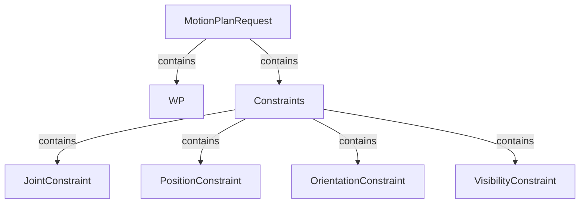

## Simple motion planning with moveit

| MoveIt concept | class | task |
| -------------- | ----- | ---- |
| Planner Manager | `PlanningManager` | |
| Planning Context | `PlanningContext` | Representation of a particular planning context, i.e. a planning scene with a planning request |

## Motion planning with Planning context and Planner manager

The `PlanningContext` [defined here](https://github.com/ros-planning/moveit/blob/382aa5a8cdd39eace07536d39c497a4b21f0f653/moveit_core/planning_interface/include/moveit/planning_interface/planning_interface.h#L80) and [implemened here](https://github.com/ros-planning/moveit/blob/master/moveit_core/planning_interface/src/planning_interface.cpp), and the planner manager `PlannerManager` [defined here](https://github.com/ros-planning/moveit/blob/ba4b60e079fd14a61c50ef34c156eee6d63e58f7/moveit_core/planning_interface/include/moveit/planning_interface/planning_interface.h#L150) and [implemented here](https://github.com/ros-planning/moveit/blob/master/moveit_core/planning_interface/src/planning_interface.cpp#L94) are the MoveIt motion planners Plugins base class.
In other words, these are the classes that must be overrided in order to create a custom MoveIt motion planner.

The basic use of a `PlanningManager` and `PlanningContext` may be resumed in the following steps

1. Initialise the planner manager with a robot model and a namespace as it is done [here](https://github.com/ros-planning/moveit/blob/382aa5a8cdd39eace07536d39c497a4b21f0f653/moveit_ros/planning/planning_pipeline/src/planning_pipeline.cpp#L116)
```C++
planner_instance_ = planner_plugin_loader_->createUniqueInstance(planner_plugin_name_);
planner_instance_->initialize(robot_model_, nh_.getNamespace()
```
2. Generate a planning context from the planner manager using the planning scene and the planning request as it is done [here](https://github.com/ros-planning/moveit/blob/382aa5a8cdd39eace07536d39c497a4b21f0f653/moveit_ros/planning/planning_pipeline/src/planning_pipeline.cpp#L242)
```C++
planning_interface::PlanningContextPtr context = planner_instance_->getPlanningContext(planning_scene, req, res.error_code_);
```
4. Solve the motion planning request as it is done [here](https://github.com/ros-planning/moveit/blob/382aa5a8cdd39eace07536d39c497a4b21f0f653/moveit_ros/planning/planning_pipeline/src/planning_pipeline.cpp#L244)
```C++
solved = context ? context->solve(res) : false;
```

## How does MoveIt represent a motion planning request

As can be seen [here](https://github.com/ros-planning/moveit/blob/45e2be9879880ac9c18b228c64ca7c0d17d5041d/moveit_core/planning_interface/include/moveit/planning_interface/planning_request.h#L46) the type `planning_interface::MotionPlanRequest` is the same as `moveit_msgs::MotionPlanRequest`.

| MoveIt message | definition | task |
| -------------- | ---------- | ---- |
|`moveit_msgs::MotionPlanRequest` | [here](http://docs.ros.org/en/melodic/api/moveit_msgs/html/msg/MotionPlanRequest.html) | |
|`moveit_msgs::WorkspaceParameters` | [here](http://docs.ros.org/en/melodic/api/moveit_msgs/html/msg/WorkspaceParameters.html) ||
|`moveit_msgs::RobotState` | [here](http://docs.ros.org/en/melodic/api/moveit_msgs/html/msg/RobotState.html) ||
|`moveit_msgs::Constraints` | [here](http://docs.ros.org/en/melodic/api/moveit_msgs/html/msg/Constraints.html)||
|`moveit_msgs::JointConstraint`|[here](http://docs.ros.org/en/melodic/api/moveit_msgs/html/msg/JointConstraint.html)||
|`moveit_msgs::PositionConstraint` | [here](http://docs.ros.org/en/melodic/api/moveit_msgs/html/msg/PositionConstraint.html) ||
|`moveit_msgs::OrientationConstraint` |[here](http://docs.ros.org/en/melodic/api/moveit_msgs/html/msg/OrientationConstraint.html) ||
|`moveit_msgs::VisibilityConstraint` | [here](http://docs.ros.org/en/melodic/api/moveit_msgs/html/msg/VisibilityConstraint.html) ||



Serveral tools to define constraints are written in [`moveit/moveit_core/kinematic_constraints/src/utils.cpp`](https://github.com/ros-planning/moveit/blob/melodic-devel/moveit_core/kinematic_constraints/src/utils.cpp).
