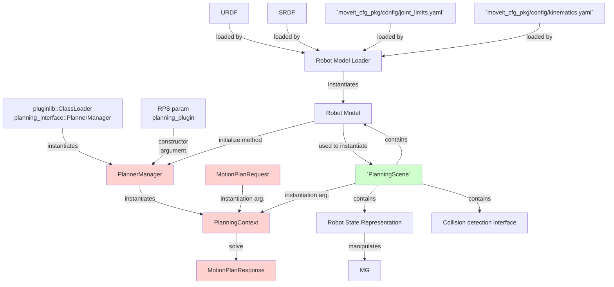

# Simple motion planning with moveit

| MoveIt concept | class | task |
| -------------- | ----- | ---- |
| Planner Manager | `PlanningManager` | |
| Planning Context | `PlanningContext` | |

# Motion planning with Planning context and Planner manager

The `PlanningContext` [defined here](https://github.com/ros-planning/moveit/blob/382aa5a8cdd39eace07536d39c497a4b21f0f653/moveit_core/planning_interface/include/moveit/planning_interface/planning_interface.h#L80) and [implemened here](https://github.com/ros-planning/moveit/blob/master/moveit_core/planning_interface/src/planning_interface.cpp), and the planner manager `PlannerManager` [defined here](https://github.com/ros-planning/moveit/blob/ba4b60e079fd14a61c50ef34c156eee6d63e58f7/moveit_core/planning_interface/include/moveit/planning_interface/planning_interface.h#L150) and [implemented here](https://github.com/ros-planning/moveit/blob/master/moveit_core/planning_interface/src/planning_interface.cpp#L94) are the MoveIt motion planners Plugins base class.

In other words, these are the classes that must be overrided in order to create a custom MoveIt motion planner.

The `PlannerManager` is the class that must be implemented as a plugin to solve the motion planning problem [here](https://github.com/ros-planning/moveit/blob/382aa5a8cdd39eace07536d39c497a4b21f0f653/moveit_ros/planning/planning_pipeline/src/planning_pipeline.cpp#L242) and [here](https://github.com/ros-planning/moveit/blob/ff50476c4070eb86d0a70aa39281d5805db13fa5/moveit_core/planning_request_adapter/src/planning_request_adapter.cpp#L54)

1. Initialise the planner manager with a robot model and a namespace as [here](https://github.com/ros-planning/moveit/blob/382aa5a8cdd39eace07536d39c497a4b21f0f653/moveit_ros/planning/planning_pipeline/src/planning_pipeline.cpp#L116)
```C++
planner_instance_ = planner_plugin_loader_->createUniqueInstance(planner_plugin_name_);
planner_instance_->initialize(robot_model_, nh_.getNamespace()
```
2. Generate a planning context from the planner manager using the planning scene and the planning request as [here](https://github.com/ros-planning/moveit/blob/382aa5a8cdd39eace07536d39c497a4b21f0f653/moveit_ros/planning/planning_pipeline/src/planning_pipeline.cpp#L242)
```C++
planning_interface::PlanningContextPtr context = planner_instance_->getPlanningContext(planning_scene, req, res.error_code_);
```
4. Solve the motion planning request as [here](https://github.com/ros-planning/moveit/blob/382aa5a8cdd39eace07536d39c497a4b21f0f653/moveit_ros/planning/planning_pipeline/src/planning_pipeline.cpp#L244)
```C++
solved = context ? context->solve(res) : false;
```



