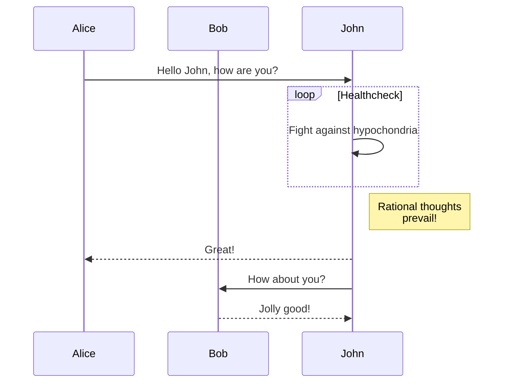

# Planning in the joint space

This example teach how to plan motions in the joint space using the moveit plugin for OMPL.

| File | Description |
| ---- | ----------- |
| `src/planning_scene_monitor.cpp` | Instance of a Planning Scene Monitor. |
| `src/planner.cpp` | Implementation of the moveit OMPL plugin |

## Current state motinor
This is an instance of Plannisn Scene motnior [defined here](https://github.com/ros-planning/moveit/blob/melodic-devel/moveit_ros/planning/planning_scene_monitor/include/moveit/planning_scene_monitor/current_state_monitor.h) and [implemented here](https://github.com/ros-planning/moveit/blob/melodic-devel/moveit_ros/planning/planning_scene_monitor/src/current_state_monitor.cpp).

## Defining constraints
    
    Serveral tools to define constraints are written in [`moveit/moveit_core/kinematic_constraints/src/utils.cpp`](https://github.com/ros-planning/moveit/blob/melodic-devel/moveit_core/kinematic_constraints/src/utils.cpp).

## `moveit_msg::JointConstraints`

- `joint_name`of type `string`
- `position`of type `float64`
- `tolerance_above`of type `float64`
- `tolerance_below`of type `float64`
- `weight`of type `float64`

## `moveit_msg::PositionConstraint`

- `header` of type `Header`
- `link_name`of type `string` The robot link this constraint refers to
- `target_point_offset`of type `geometry_msgs/Vector3` The offset (in the link frame) for the target point on the link we are planning for
- `constraint_region`of type `BoundingVolume` The volume this constraint refers to 
- `weight`of type `float64` A weighting factor for this constraint (denotes relative importance to other constraints. Closer to zero means less important)

## `moveit_msg::BoundingVolume`

- `primitives`of type `shape_msgs/SolidPrimitive[]` A set of solid geometric primitives that make up the volume to define (as a union)
- `primitive_poses`of type `geometry_msgs/Pose[]` The poses at which the primitives are located
- `meshes`of type `shape_msgs/Mesh[]` In addition to primitives, meshes can be specified to add to the bounding volume (again, as union)
- `mesh_poses`of type `geometry_msgs/Pose[]` The poses at which the meshes are located

