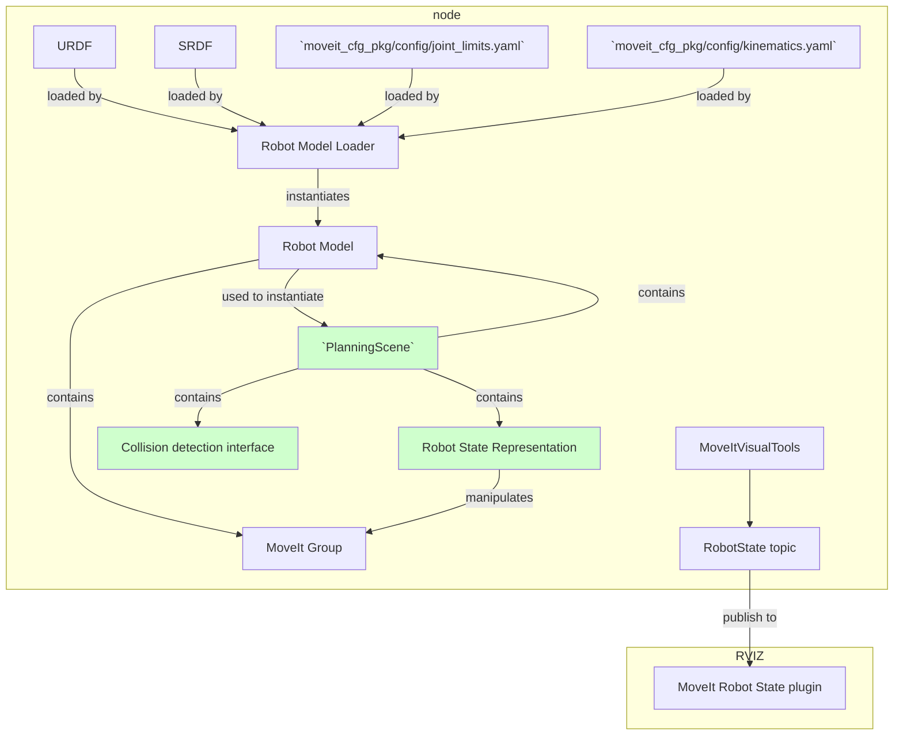

# MoveIt visual tools

The `MoveItVisualTools` inherits from `RvizVisualTools`.
`RvizVisualTools` have the `MarkerArray markers_` property
this have a the property `remote_control_` of class `rviz_visual_tools::RemoteControl` [declared here](https://github.com/PickNikRobotics/rviz_visual_tools/blob/240b6ecf0f05ff5c08d4382b18db8c47b091663d/include/rviz_visual_tools/remote_control.h#L54) 
`RemoteControl` is a Tool for creating break points and user verification points through manipulation pipelines.

It has a main constructor

```C++
  MoveItVisualTools(const std::string& base_frame,
                    const std::string& marker_topic = rviz_visual_tools::RVIZ_MARKER_TOPIC,
                    robot_model::RobotModelConstPtr robot_model = robot_model::RobotModelConstPtr());
```
Both constructors calls the `RvizVisualTools` constructor as follows
```C++
                    RvizVisualTools::RvizVisualTools(base_frame, marker_topic)
```
The `base_frame` is the frame of stored in the headers for the markers generated by `RvizVisualTools`.

The marker topic is [defined here](https://github.com/PickNikRobotics/rviz_visual_tools/blob/1a1a4d153acdb465606d4c058cb91dcffdd1eb28/include/rviz_visual_tools/rviz_visual_tools.h#L86).

- `RvizVisualTools::loadMarkerPub` instantiates the publisher `RvizVisualTools::pub_rviz_markers_` of `visualization_msgs::MarkerArray` to the marker topic specified in the constructor. 
- `loadRobotStatePub(string& robot_state_topic, bool blocking)` instantiates a publisher of `moveit_msgs::DisplayRobotState` and at the topic `robot_state_topic`.

- `RvizVisualTools::trigger` [defined here](https://github.com/PickNikRobotics/rviz_visual_tools/blob/1a1a4d153acdb465606d4c058cb91dcffdd1eb28/src/rviz_visual_tools.cpp#L862) This function calls `RvizVisualTools::publishMarkers` [defined here](https://github.com/PickNikRobotics/rviz_visual_tools/blob/1a1a4d153acdb465606d4c058cb91dcffdd1eb28/src/rviz_visual_tools.cpp#L880) which publishes markers using `pub_rviz_markers_`.

- `RvizVisualTools::prompt` [defined here](https://github.com/PickNikRobotics/rviz_visual_tools/blob/1a1a4d153acdb465606d4c058cb91dcffdd1eb28/src/rviz_visual_tools.cpp#L2771) this function calls `RemoteControl::waitForNextStep` [defined here](https://github.com/PickNikRobotics/rviz_visual_tools/blob/240b6ecf0f05ff5c08d4382b18db8c47b091663d/src/remote_control.cpp#L138).     


## How to publish a robot state
```C++
bool MoveItVisualTools::publishRobotState(const trajectory_msgs::JointTrajectoryPoint& trajectory_pt,
                                          const moveit::core::JointModelGroup* jmg,
                                          const rviz_visual_tools::colors& color=rviz_visual_tools::DEFAULT)
{
  return publishRobotState(trajectory_pt.positions, jmg, color);
}

bool MoveItVisualTools::publishRobotState(const std::vector<double>& joint_positions,
                                          const moveit::core::JointModelGroup* jmg,
                                          const rviz_visual_tools::colors& color= = rviz_visual_tools::DEFAULT)
{
  // Always load the robot state before using
  loadSharedRobotState();

  // Set robot state
  shared_robot_state_->setToDefaultValues();  // reset the state just in case
  shared_robot_state_->setJointGroupPositions(jmg, joint_positions);

  // Publish robot state
  return publishRobotState(*shared_robot_state_, color);
}

bool MoveItVisualTools::publishRobotState(const moveit::core::RobotStatePtr& robot_state,
                                          const rviz_visual_tools::colors& color = rviz_visual_tools::DEFAULT,
                                          const std::vector<std::string>& highlight_links= {})
{
  return publishRobotState(*robot_state.get(), color, highlight_links);
}

bool MoveItVisualTools::publishRobotState(const moveit::core::RobotState& robot_state,
                                          const rviz_visual_tools::colors& color = rviz_visual_tools::DEFAULT,
                                          const std::vector<std::string>& highlight_links={})
{
  moveit_msgs::DisplayRobotState& display_robot_msg = display_robot_msgs_[base_color];
 // ... add colors ...
  publishRobotState(display_robot_msg);

 //... more stuff ...
  return true;
}

void MoveItVisualTools::publishRobotState(const moveit_msgs::DisplayRobotState& robot_state_msg)
{
  loadRobotStatePub();
  pub_robot_state_.publish(robot_state_msg);
  ros::spinOnce();
}
```

# How did we create this package?

```
catkin create pkg PROJECT_NAME --catkin-deps roscpp moveit_core moveit_ros_planning_interface moveit_visual_tools --system-deps Eigen3
```


