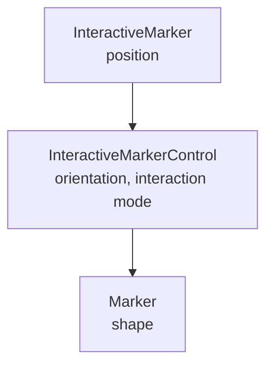

# Work in progress
## How did we create this package?
```bash
catkin create pkg a_interactivity --catkin-deps moveit_ros_planning_interface moveit_core rviz_visual_tools moveit_visual_tools interactive_markers --system-deps Eigen3
```

## Interactive Markers

Interactive markers are markers that allow the user to interact with them.
The possibile actions are
- changing their position 
- change rotation
- clicking on them
- selecting something from a context menu assigned to each marker.

They are represented by the `visualization_msgs/InteractiveMarker` message, which contains a context menu and several controls.
The controls are defined by a `visualization_msgs/InteractiveMarkerControl` message.
A control is composed by different vissual parts. 
Each of these partes are a marker described by a `visualization_msgs/Marker`.
Each control has an **interaction mode**, i.e. a way that the user can change its state.


## Interactive marker server

Declared [here](https://github.com/ros-visualization/interactive_markers/blob/051af05d3eb4378938e89fbf6030f5e3a6ad014a/include/interactive_markers/interactive_marker_server.h#L57) and defined [here](https://github.com/ros-visualization/interactive_markers/blob/051af05d3eb4378938e89fbf6030f5e3a6ad014a/src/interactive_marker_server.cpp#L42).


```C++
  typedef boost::function< void ( const FeedbackConstPtr& ) > FeedbackCallback;
```

```C++
  typedef visualization_msgs::InteractiveMarkerFeedbackConstPtr FeedbackConstPtr;
```

`visualization_msgs::InteractiveMarkerFeedbackConstPtr` is [defined here](http://docs.ros.org/en/melodic/api/visualization_msgs/html/msg/InteractiveMarkerFeedback.html).
## Interactive marker message

It is part of the [vissualization message packate](http://wiki.ros.org/visualization_msgs) defined [here](http://docs.ros.org/en/api/visualization_msgs/html/msg/InteractiveMarker.html)
```
std_msgs/Header header
geometry_msgs/Pose pose
string name
string description
float32 scale
visualization_msgs/MenuEntry[] menu_entries
visualization_msgs/InteractiveMarkerControl[] controls
```

## Interactive marker control

Represents a control that is to be displayed together with an interactive marker.
