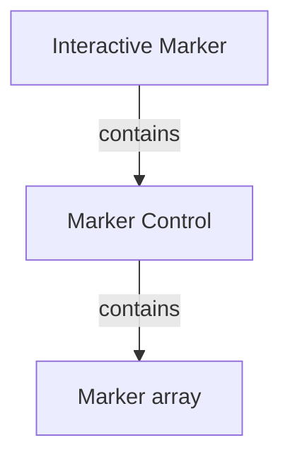

# Work in Progress
## RVIZ visual tools

RVIZ visuak tools are C++ API wrapper for displaying shapes and meshes in Rviz via helper functions that publish markers [with source here](https://github.com/PickNikRobotics/rviz_visual_tools).

- **Definition** (*Marker*). A **Marker** is a shape that ca be displayed by RVIZ.

Markers are defined by marker messages that can be directly readed by RVIZ.

```bash
catkin create pkg a_interactive_markers --catkin-deps roscpp interactive_markers rviz_visual_tools --system-deps Eigen3
```




## Example 1 `a_move_along_x`
