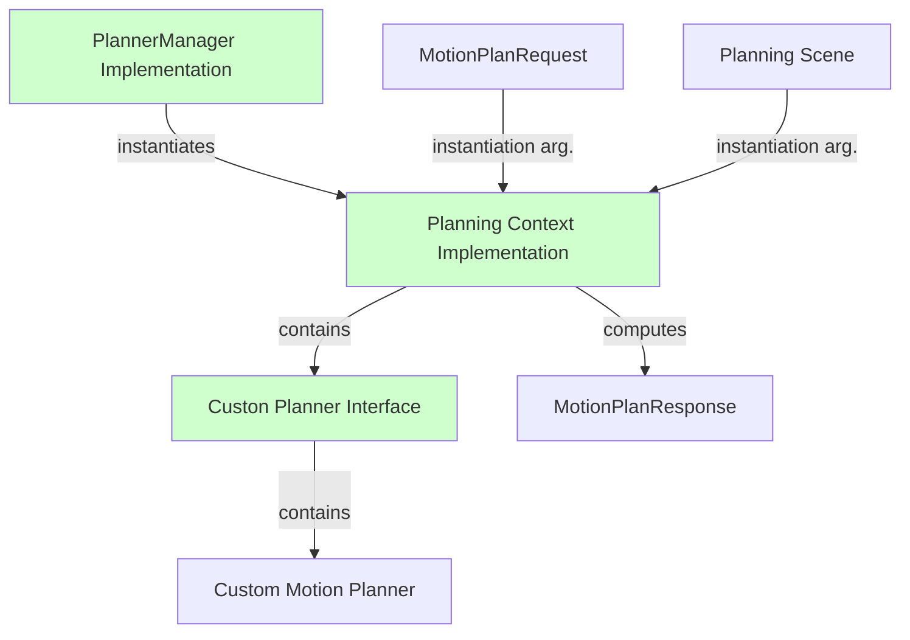

# Making custom motion planners available in MoveIt

| MoveIt concept | class | task |
| -------------- | ----- | ---- |
| Motion Plan Request | `MotionPlanRequest` | Definition of a complete motion planning problem |
| Motion Plan Response | `MotionPlanResponse` | Output of a motion planner  |
| Robot Trajectory | `RobotTrajectory` | Solution of a motion planning problem (wrapper of `trajectory_msgs::JointTrajectory`)|
| Planning Context | `PlanningContext` | Representation of a particular planning context, i.e. a planning scene with a planning request |
| Planner Manager | `PlanningManager` | Custom motion planning solver. |

## Intended architecture 

## Planning Manager

| `planning_interface::PlannerManager` pure virtual method | task |
| -------------- | ---- |
| `PlanningContextPtr getPlanningContext(const planning_scene::PlanningSceneConstPtr& planning_scene,const MotionPlanRequest& req,moveit_msgs::MoveItErrorCodes& error_code) const ` | Construct a planning context given the current scene and a planning request |
| `bool canServiceRequest(const MotionPlanRequest& req)` |  Determine whether this plugin instance is able to solve this planning request |

|`planning_interface::PlannerManager` implemented classes | task |
| -------------- | ---- |
| `PlannerManager()` | Does nothing| 
| `~PlannerManager()` | Does nothing| 
| `getDescription() const` | | 
|`getPlanningAlgorithms(std::vector<std::string> & algs) const`| |
|`getPlanningContext(const planning_scene::PlanningSceneConstPtr & planning_scene,const MotionPlanRequest & req) const`| |
|`initialize(const moveit::core::RobotModelConstPtr &,const std::string &)`| |
|`setPlannerConfigurations(const PlannerConfigurationMap & pcs)`| |
|`terminate() const`| |

| `planning_interface::PlanningContext` pure virtual method | task |
| -------------- | ---- |
| `bool solve(MotionPlanDetailedResponse& res)` | Solve the motion planning problem |
| `bool solve(MotionPlanResponse& res)`| Solve the motion planning problem | 
| `bool terminate()` | If solve() is running, terminate the computation |
| `void clear() ` |  Clear data structures used by the planner |

|`planning_interface::PlanningContext` implemented classes | task |
|`PlanningContext(const std::string & name,const std::string & group)`| add `this` to the list of active contexts|
| `~PlanningContext()` | erase `this` from the list of active contexts | 
|`setMotionPlanRequest(const MotionPlanRequest & request)`||
|`setPlanningScene(const planning_scene::PlanningSceneConstPtr & planning_scene)`||

## Active Context tracking

MoveIt keep tracks of each `planning_interface::PlanningContext` instantiated in [this local static variable](https://github.com/ros-planning/moveit/blob/f4ebdd4a28e54ee6b3de61324446ea6bdda4b374/moveit_core/planning_interface/src/planning_interface.cpp#L54) retrieved via the [static function `getActiveContexts`](https://github.com/ros-planning/moveit/blob/f4ebdd4a28e54ee6b3de61324446ea6bdda4b374/moveit_core/planning_interface/src/planning_interface.cpp#L52).
The `PlanningContext`'s are stored in a class called `ActiveContexts` [defined here](https://github.com/ros-planning/moveit/blob/f4ebdd4a28e54ee6b3de61324446ea6bdda4b374/moveit_core/planning_interface/src/planning_interface.cpp#L46) which contains a `std::set` of `PlanningContext`'s and a `boost::mutex`.
