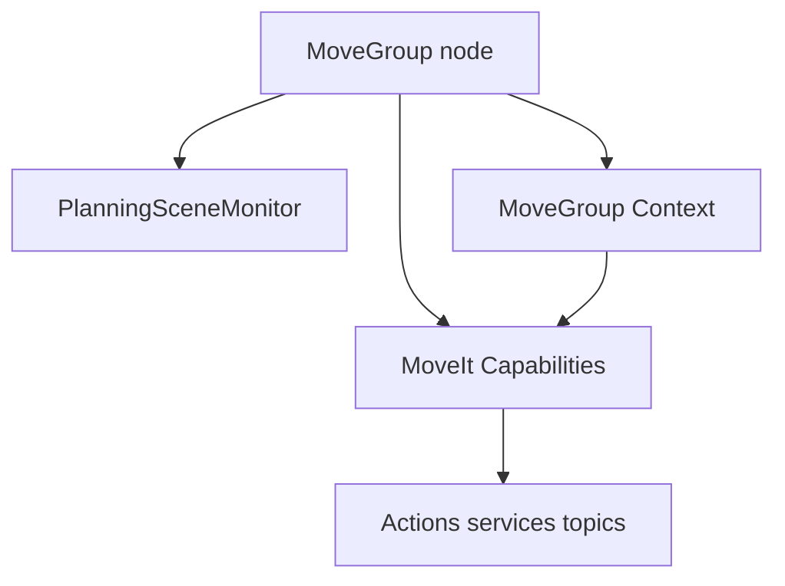
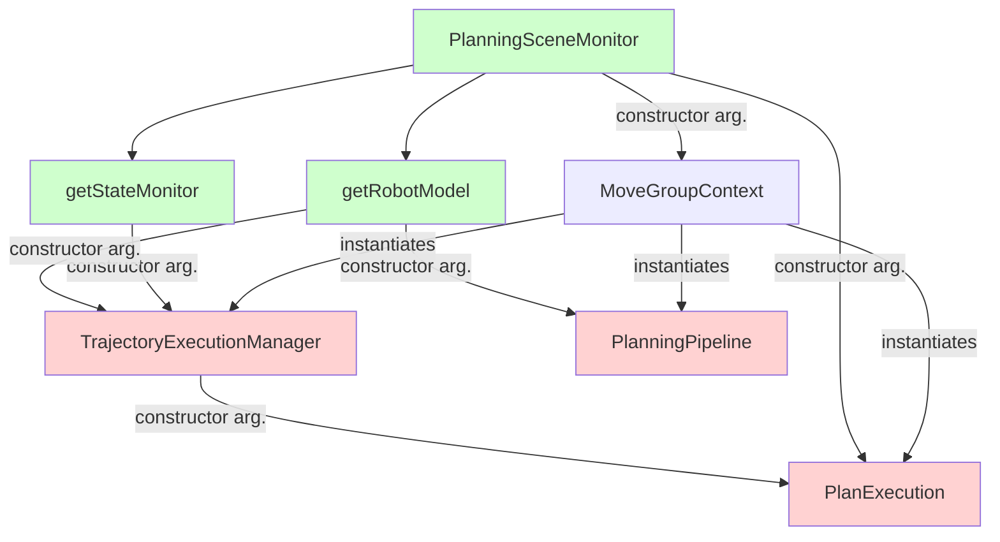

# Move Group

The movegroup is a combination of a Planning Scene Monitor, a Movegroup Context and MoveIt Capabilities.

- The Planning Scene Monitor was addressed in the in section 02.
- The Movegroup Context, [declared here](https://github.com/ros-planning/moveit/blob/45e2be9879880ac9c18b228c64ca7c0d17d5041d/moveit_ros/move_group/include/moveit/move_group/move_group_context.h#L67) and [defined here](https://github.com/ros-planning/moveit/blob/45e2be9879880ac9c18b228c64ca7c0d17d5041d/moveit_ros/move_group/src/move_group_context.cpp#L43) is a grapper of several MoveIt components that make it possible to plan and execute a motion.

- A MoveIt Capability is the standart way to interact with the movegroup node. A MoveIt Capability is an implementation of the plugin base class is [declared here](https://github.com/ros-planning/moveit/blob/45e2be9879880ac9c18b228c64ca7c0d17d5041d/moveit_ros/move_group/include/moveit/move_group/move_group_capability.h#L58) and [defined here](https://github.com/ros-planning/moveit/blob/melodic-devel/moveit_ros/move_group/src/move_group_capability.cpp). MoveIt capabilities are wrappers to interact with the MoveGroup Context.

## Move Group context
The `MoveGroupContext` is [declared here](https://github.com/ros-planning/moveit/blob/45e2be9879880ac9c18b228c64ca7c0d17d5041d/moveit_ros/move_group/include/moveit/move_group/move_group_context.h#L67) and [defined here](https://github.com/ros-planning/moveit/blob/45e2be9879880ac9c18b228c64ca7c0d17d5041d/moveit_ros/move_group/src/move_group_context.cpp#L43).
The `MoveGroupContext` is a container of the following elements, which also instantiates
- `planning_scene_monitor::PlanningSceneMonitorPtr planning_scene_monitor_`
- `trajectory_execution_manager::TrajectoryExecutionManagerPtr trajectory_execution_manager_`
- `planning_pipeline::PlanningPipelinePtr planning_pipeline_`
- `plan_execution::PlanExecutionPtr plan_execution_`
- `plan_execution::PlanWithSensingPtr plan_with_sensing_`

## Move Group Capabilities

The Movegroup capability plugin base class is [declared here](https://github.com/ros-planning/moveit/blob/45e2be9879880ac9c18b228c64ca7c0d17d5041d/moveit_ros/move_group/include/moveit/move_group/move_group_capability.h#L58) and [defined here](https://github.com/ros-planning/moveit/blob/melodic-devel/moveit_ros/move_group/src/move_group_capability.cpp).

The default capabilities are declared and implemented [here](https://github.com/ros-planning/moveit/tree/melodic-devel/moveit_ros/move_group/src/default_capabilities)

| **Protected non virtual Methods** | **Use** |
| --------------------  | ------- |
|`clearRequestStartState` | Returns a `planning_interface::MotionPlanRequest` with default constructed `start_state` member|
|`clearSceneRobotState` | Returns a `moveit_msgs::PlanningScene` with a default constructed `robot_state` member |
|`convertToMsg` (several implementations) | converts in different ways `ExecutableTrajectory`, `robot_trajectory::RobotTrajectory` into `moveit_msgs::RobotTrajectory`  |
|`getActionResultString` | Converts `moveit_msgs::MoveItErrorCodes` into a string |
|`performTransform` | does [this](https://github.com/ros-planning/moveit/blob/45e2be9879880ac9c18b228c64ca7c0d17d5041d/moveit_ros/move_group/src/move_group_capability.cpp#L192) |
|`stateToStr(MoveGroupState state) const` | converts `MoveGroupState` into a string|

| **Protected Members** | **Use** |
| --------------------  | ------- |
|`capability_name_` | name given by the constructor|
|`context_` | `MoveGroupContext` set by `setContext`|
|`node_handle_` | private namespace node handle|
|`root_node_handle_` | node handle default constructed |

| **Public non virtual Methods** | **Use** |
| --------------------  | ------- |
|`MoveGroupCapability(const std::string & capability_name)` | sets the `capability_name_` and `node_handle_`|
|`getName() const` | returns `capability_name_`|
|`setContext(const MoveGroupContextPtr & context)` | set the member `context_` |

| **Public virtual Methods** | **Use** |
| --------------------  | ------- |
|`~MoveGroupCapability()` | |

| **Public pure virtual Methods** | **Use** |
| --------------------  | ------- |
|`initialize()` | |
