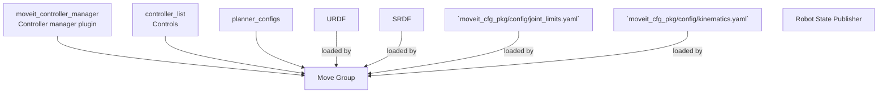

# Move Group minimal setup

```mermaid
graph TD;
    MCM[moveit_controller_manager<br/>Controller manager plugin] --> MG[Move Group];
    CL[controller_list<br/>Controls] --> MG[Move Group];
    PC[planner_configs] --> MG;
    URDF -- loaded by --> MG;
    SRDF -- loaded by --> MG;
    J[`moveit_cfg_pkg/config/joint_limits.yaml`] -- loaded by --> MG;
    K[`moveit_cfg_pkg/config/kinematics.yaml`] -- loaded by --> MG;
    RSP[Robot State Publisher];
```
