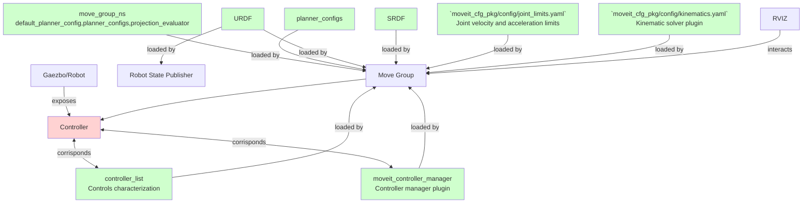

# Move Group minimal setup



The list of required parameters are
- `robot_description` the urdf of the robot
- `robot_description_semantic` the srdf of the robot
- `robot_description_planning/joint_limits/*` speed and acceleration limits of the joints.
- `robot_description_kinematics/GROUP_NAME` inverse and direct kinematic solver pluging and its parameters for each group.
- `move_group/moveit_controller_manager` plugin to handle `ros_control`
- `move_group/controller_list` list of controllers that can be handle with the controller manager
- `move_group/planning_plugin` pluging for the motion planning
- `move_group/planner_configs/*` parameters that configure the planner pluging
- `move_group/GROUP_NAME/default_planner_config` default configuration of the planner for the group
- `move_group/GROUP_NAME/planner_configs` available configurations of the planner for the group
- `move_group/GROUP_NAME/*`custon parameters for the planner.
- `move_group/request_adapters` a space separated list of planning request adapter plugings
- `move_group/start_state_max_bounds_error` ?
- `move_group/planning_scene_monitor/[publish_planning_scene,publish_geometry_updates,publish_state_updates,publish_transforms_updates]` ?


## Movegroup default capabilities
Names are [here](https://github.com/ros-planning/moveit/blob/melodic-devel/moveit_ros/move_group/include/moveit/move_group/capability_names.h)
- `move_group/MoveGroupCartesianPathService` Wrapper for `robot_state::RobotState::computeCartesianPath` [declared here](https://github.com/ros-planning/moveit/blob/45e2be9879880ac9c18b228c64ca7c0d17d5041d/moveit_core/robot_state/include/moveit/robot_state/robot_state.h#L1181) and [defined here](https://github.com/ros-planning/moveit/blob/45e2be9879880ac9c18b228c64ca7c0d17d5041d/moveit_core/robot_state/src/robot_state.cpp#L1924). This computes the sequence of joint values that correspond to a straight Cartesian path for a particular group.
Provides a [GetCartesianPath](http://docs.ros.org/en/melodic/api/moveit_msgs/html/srv/GetCartesianPath.html) service and publishes a [DisplayTrajectory](http://docs.ros.org/en/melodic/api/moveit_msgs/html/msg/DisplayTrajectory.html) topic.

- `move_group/MoveGroupKinematicsService` [see here](https://github.com/ros-planning/moveit/blob/melodic-devel/moveit_ros/move_group/src/default_capabilities/kinematics_service_capability.h). This is a wrapper for `robot_state::RobotState::setFromIK` [defined here](https://github.com/ros-planning/moveit/blob/45e2be9879880ac9c18b228c64ca7c0d17d5041d/moveit_core/robot_state/src/robot_state.cpp#L1372) and `robot_state::RobotState::getGlobalLinkTransform`. Provides a direct and inverse kinematic service [GetPositionFK](http://docs.ros.org/en/melodic/api/moveit_msgs/html/srv/GetPositionFK.html) abd [GetPositionIK](http://docs.ros.org/en/melodic/api/moveit_msgs/html/srv/GetPositionIK.html)
    - **GetPositionFK** input: link names to compute FK, robot state. Output: [`geometry_msgs/PoseStamped`](http://docs.ros.org/en/melodic/api/geometry_msgs/html/msg/PoseStamped.html) and repective link names.
    - **GetPositionIK** input: [`moveit_msgs/PositionIKRequest`](http://docs.ros.org/en/melodic/api/moveit_msgs/html/msg/PositionIKRequest.html). Output: [`moveit_msgs/RobotState`](http://docs.ros.org/en/melodic/api/moveit_msgs/html/msg/RobotState.html).

- `move_group/MoveGroupExecuteTrajectoryAction` [defined here](https://github.com/ros-planning/moveit/blob/melodic-devel/moveit_ros/move_group/src/default_capabilities/execute_trajectory_action_capability.cpp). This is a wrapper of `trajectory_execution_manager::TrajectoryExecutionManager::execute`.  This capability instantiates an action server.

- `move_group/MoveGroupMoveAction` [definede here](https://github.com/ros-planning/moveit/blob/melodic-devel/moveit_ros/move_group/src/default_capabilities/move_action_capability.cpp). This is a wrapper to `plan_execution::PlanExecution::planAndExecute`.

- `move_group/MoveGroupPlanService` [defined here](https://github.com/ros-planning/moveit/blob/melodic-devel/moveit_ros/move_group/src/default_capabilities/plan_service_capability.cpp). This is a wrapper to `planning_pipeline::PlanningPipeline::generatePlan`.

- `move_group/MoveGroupQueryPlannersService` [defined here](https://github.com/ros-planning/moveit/blob/melodic-devel/moveit_ros/move_group/src/default_capabilities/query_planners_service_capability.cpp). Services to get and set information from the `planning_interface::PlannerManager` associated to the pipeline context.

- `move_group/MoveGroupStateValidationService` [defined here](https://github.com/ros-planning/moveit/blob/melodic-devel/moveit_ros/move_group/src/default_capabilities/state_validation_service_capability.cpp).

- `move_group/MoveGroupGetPlanningSceneService` [defined here](https://github.com/ros-planning/moveit/blob/melodic-devel/moveit_ros/move_group/src/default_capabilities/get_planning_scene_service_capability.cpp). Calls `PlanningSceneMonitor::providePlanningSceneService` at its initialization.
- `move_group/ApplyPlanningSceneService` [defined here](https://github.com/ros-planning/moveit/blob/melodic-devel/moveit_ros/move_group/src/default_capabilities/apply_planning_scene_service_capability.cpp). Wrapper to `PlanningSceneMonitor::newPlanningSceneMessage`.
- `move_group/ClearOctomapService` [defined here](https://github.com/ros-planning/moveit/blob/melodic-devel/moveit_ros/move_group/src/default_capabilities/clear_octomap_service_capability.cpp).
## Package creation

1. Create the catking package
```CMake
catkin create pkg package_name --catkin-deps roscpp moveit_core moveit_ros_planning_interface
```

**Note** this package does not have compilation dependencies. The catkin dependecies here are just formal. 


