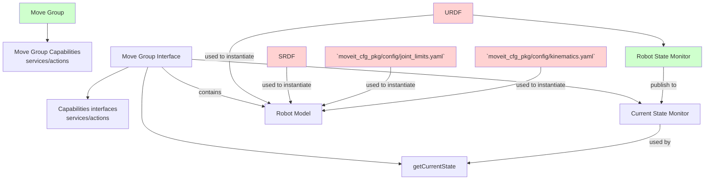

# How to create this package
```bash
catkin create pkg a_b_moveit_interface --catkin-deps rospy roscpp moveit_core moveit_ros_planning_interface moveit_visual_tools --system-deps Eigen3
```

# Movegroup Interface and Planningscene Interface



- The class `planning_interface::PlanningSceneInterface` is [declared here](https://github.com/ros-planning/moveit/blob/46f110491ed9a21c88f89a09f30029ac251d6d94/moveit_ros/planning_interface/planning_scene_interface/include/moveit/planning_scene_interface/planning_scene_interface.h#L53) and [defined here](https://github.com/ros-planning/moveit/blob/46f110491ed9a21c88f89a09f30029ac251d6d94/moveit_ros/planning_interface/planning_scene_interface/src/planning_scene_interface.cpp#L296).  Its main implementation is done in `planning_interface::PlanningSceneInterface::PlanningSceneInterfaceImpl` is [defined and implemented here](https://github.com/ros-planning/moveit/blob/46f110491ed9a21c88f89a09f30029ac251d6d94/moveit_ros/planning_interface/planning_scene_interface/src/planning_scene_interface.cpp#L50).

- The class `moveit::planning_interface::MoveGroupInterface` is [declared here](https://github.com/ros-planning/moveit/blob/melodic-devel/moveit_ros/planning_interface/move_group_interface/include/moveit/move_group_interface/move_group_interface.h) [defined here](https://github.com/ros-planning/moveit/blob/melodic-devel/moveit_ros/planning_interface/move_group_interface/src/move_group_interface.cpp).
However, the main implementations happens in the class `moveit::planning_interface::MoveGroupInterface::MoveGroupInterfaceImpl`.
**By default the construction of this instance will block until the `MoveGroup` capability services are up**.

The robot models is obtained [here](https://github.com/ros-planning/moveit/blob/460be6b949c1febf3d3e9ad4041604935a3668a8/moveit_ros/planning_interface/common_planning_interface_objects/src/common_objects.cpp#L116).

This lib uses the [`StaticStorage`](https://github.com/ros-planning/moveit/blob/460be6b949c1febf3d3e9ad4041604935a3668a8/moveit_ros/planning_interface/common_planning_interface_objects/src/common_objects.cpp#L46) class, which is a container of a mutex, a  `std::map<std::string, robot_model::RobotModelWeakPtr>` and a `std::map<std::string, CurrentStateMonitorWeakPtr>`.


This class interacts with the following default moveit capabilities

- `move_group/MoveGroupCartesianPathService`
    - `moveit_msgs::GetCartesianPath`
- `move_group/MoveGroupExecuteTrajectoryAction`
    - `moveit_msgs::ExecuteTrajectoryAction` on `execute_trajectory` namespace
- `move_group/MoveGroupMoveAction`
    - `moveit_msgs::MoveGroupAction` `move_group`
- `move_group/MoveGroupQueryPlannersService`
    - `moveit_msgs::QueryPlannerInterfaces` on service `query_planner_interface`
    - `moveit_msgs::GetPlannerParams` on service `get_planner_params`
    - `moveit_msgs::SetPlannerParams`
- `move_group/MoveGroupPickPlaceAction`
    - `moveit_msgs::PickupAction` on `pickup`
    - `moveit_msgs::PlaceAction` on `place`

## Its constructor

```C++
moveit::planning_interface::MoveGroupInterface::MoveGroupInterface(const std::string& group_name,
                                                                   const std::shared_ptr<tf2_ros::Buffer>& tf_buffer,
                                                                   const ros::WallDuration& wait_for_servers)
{
  if (!ros::ok())
    throw std::runtime_error("ROS does not seem to be running");
  impl_ = new MoveGroupInterfaceImpl(Options(group_name), tf_buffer ? tf_buffer : getSharedTF(), wait_for_servers);
}
```


### MoveGroupImp constructor

```C++
  MoveGroupInterfaceImpl(const Options& opt, const std::shared_ptr<tf2_ros::Buffer>& tf_buffer,
                         const ros::WallDuration& wait_for_servers)
    : opt_(opt), node_handle_(opt.node_handle_), tf_buffer_(tf_buffer)
  {
    robot_model_ = opt.robot_model_ ? opt.robot_model_ : getSharedRobotModel(opt.robot_description_);

    joint_model_group_ = getRobotModel()->getJointModelGroup(opt.group_name_);

    joint_state_target_.reset(new robot_state::RobotState(getRobotModel()));
    joint_state_target_->setToDefaultValues();
    /* set planning target stuff ... */

    if (joint_model_group_->isChain())
      end_effector_link_ = joint_model_group_->getLinkModelNames().back();
    pose_reference_frame_ = getRobotModel()->getModelFrame();

    /*
        - advertize std_msgs::String on `trajectory_execution_event`
        - advertize moveit_msgs::AttachedCollisionObject on `attached_collision_object`
    */

    current_state_monitor_ = getSharedStateMonitor(robot_model_, tf_buffer_, node_handle_);

    ros::WallTime timeout_for_servers = ros::WallTime::now() + wait_for_servers;
    if (wait_for_servers == ros::WallDuration())
      timeout_for_servers = ros::WallTime();  // wait for ever
    double allotted_time = wait_for_servers.toSec();
    
    /*
    ## instantiate simple action clients 
        - move_action_client_ moveit_msgs::MoveGroupAction on `move_group` relative namespace
        - pick_action_client_ moveit_msgs::PickupAction on `pickup` relative namespace
        - place_action_client_ moveit_msgs::PlaceAction on `place` relative namespace
        - execute_action_client_ moveit_msgs::ExecuteTrajectoryAction on `execute_trajectory` namespace
    ## Instantiates service clients
        - query_service_ moveit_msgs::QueryPlannerInterfaces `query_planner_interface`
        - query_service_ moveit_msgs::GetPlannerParams `get_planner_params`
        - set_params_service_ moveit_msgs::SetPlannerParams ``
        - cartesian_path_service_ moveit_msgs::GetCartesianPath CARTESIAN_PATH_SERVICE_NAME
        - plan_grasps_service_ moveit_msgs::GraspPlanning GRASP_PLANNING_SERVICE_NAME
    */

  }
```
#### Wait for action
```C++
  template <typename T>
  void waitForAction(const T& action, const std::string& name, const ros::WallTime& timeout, double allotted_time)
  {
    ROS_DEBUG_NAMED("move_group_interface", "Waiting for move_group action server (%s)...", name.c_str());

    // wait for the server (and spin as needed)
    if (timeout == ros::WallTime())  // wait forever
    {
      while (node_handle_.ok() && !action->isServerConnected())
      {
        ros::WallDuration(0.001).sleep();
        // explicit ros::spinOnce on the callback queue used by NodeHandle that manages the action client
        ros::CallbackQueue* queue = dynamic_cast<ros::CallbackQueue*>(node_handle_.getCallbackQueue());
        if (queue)
          queue->callAvailable();
      }
    }
    else  // wait with timeout
    {
      while (node_handle_.ok() && !action->isServerConnected() && timeout > ros::WallTime::now())
      {
        ros::WallDuration(0.001).sleep();
        // explicit ros::spinOnce on the callback queue used by NodeHandle that manages the action client
        ros::CallbackQueue* queue = dynamic_cast<ros::CallbackQueue*>(node_handle_.getCallbackQueue());
        if (queue)
          queue->callAvailable();
      }
    }

    if (!action->isServerConnected())
    {
      std::stringstream error;
      error << "Unable to connect to move_group action server '" << name << "' within allotted time (" << allotted_time
            << "s)";
      throw std::runtime_error(error.str());
    }
  }
```


## Pick and place capability

Declared [here](https://github.com/ros-planning/moveit/blob/3361b2d1b6b2feabc2d3e93c75653f5a00e87fa4/moveit_ros/manipulation/move_group_pick_place_capability/src/pick_place_action_capability.h#L49) and defined [here](https://github.com/ros-planning/moveit/blob/3361b2d1b6b2feabc2d3e93c75653f5a00e87fa4/moveit_ros/manipulation/move_group_pick_place_capability/src/pick_place_action_capability.cpp#L42). 

Uses the pick place base [declared here](https://github.com/ros-planning/moveit/blob/3361b2d1b6b2feabc2d3e93c75653f5a00e87fa4/moveit_ros/manipulation/pick_place/include/moveit/pick_place/pick_place.h#L53) and [defined here](https://github.com/ros-planning/moveit/blob/3361b2d1b6b2feabc2d3e93c75653f5a00e87fa4/moveit_ros/manipulation/pick_place/src/pick_place.cpp);
