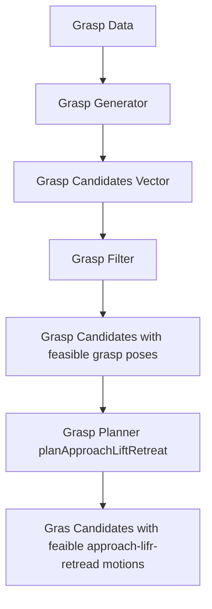

# Build
```
catkin create pkg d_moveit_graps --catkin-deps rospy roscpp moveit_core moveit_ros_planning_interface moveit_visual_tools moveit_graps --system-deps Eigen3
```

# Components
- **Grasp Candidate**: Container of "how to grasp" information. Is the container of data structure GraspTrajectories (array of array of robot states).
- **Grasp Data**: holds the information that characterizes a grasp. This is necssra to construct the Grasp Candidate.
- **Grasp Generator**: Generate grasps candidates for a cuboit
- **Grasp Filter**: From a list of grasp candidates, return the grasp that are kinematically feasible.
- **Grasp Planner**: Takes a grasp candidate and fill the `GraspTrajectories` with the approach, lift and retread motions necessary for the grasp.



# Grasp Generation


[Declared here](https://github.com/ros-planning/moveit_grasps/blob/464a0c5993d378648940c8cd690f0e52aa907002/include/moveit_grasps/grasp_generator.h#L95) and [implemented here](https://github.com/ros-planning/moveit_grasps/blob/464a0c5993d378648940c8cd690f0e52aa907002/src/grasp_generator.cpp#L62)

### Members

- `Eigen::Isometry3d ideal_grasp_pose_`

- `moveit_visual_tools::MoveItVisualToolsPtr visual_tools_` class for publishing stuff to rviz

- Debugging pars
    - `bool verbose_` Display more output both in console
    - `bool show_prefiltered_grasps_`
    - `double show_prefiltered_grasps_speed_`

- `Eigen::Isometry3d object_global_transform_` Transform from frame of box to global frame

- `double min_grasp_distance_, max_grasp_distance_`

- `Eigen::Vector3d min_translations_, max_translations_`
- `GraspScoreWeightsPtr grasp_score_weights_`


- Definition of the ideal grasp pose
    - `void GraspGenerator::setIdealTCPGraspPoseRPY`
    - `setIdealTCPGraspPose(Eigen::Isometry3d ideal_pose)`
    - `Eigen::Isometry3d getIdealTCPGraspPose()`
- Grasp weights
    - `void setGraspScoreWeights(const GraspScoreWeightsPtr& grasp_score_weights)`
    - `const GraspScoreWeightsPtr& getGraspScoreWeights()`
- Process Grasp message
    - `publishGraspArrow`
- Visualization
    - `publishGraspArrow`
    - `visualizeAnimatedGrasps`
- Grasp generation
    - `generateGrasps` **Virtual** Given a `Eigen::Isometry3d& cuboid_pose, double depth, double width, double height` and `const moveit_grasps::GraspDataPtr& grasp_data` this returns a `std::vector<GraspCandidatePtr>`
    - `getGraspWaypoints` **Static** Given a `GraspCandidate` compute the pre-grasp, grasp, lift and retreat poses for a grasp candidate
    - `getPreGraspDirection` convert `moveit_msgs::Grasp::direction` into a `Eigen::Vector3d`
    - `getPreGraspPose` extracts a `geometry_msgs::PoseStamped` from  a `GraspCandidate`
    - `getGraspScoreWeights`

## Constructor

```C++
GraspGenerator::GraspGenerator(const moveit_visual_tools::MoveItVisualToolsPtr& visual_tools, bool verbose)
: ideal_grasp_pose_(Eigen::Isometry3d::Identity())
, visual_tools_(visual_tools)
, verbose_(verbose)
, nh_("~/moveit_grasps/generator")
, grasp_score_weights_(std::make_shared<GraspScoreWeights>())
{
    // Setup error namespace and message
}
```

## Ros data parameters

- `base_link`
- `pregrasp_time_from_start`
- `grasp_time_from_start`
- `grasp_resolution`
- `grasp_min_depth`
- `grasp_max_depth`
- `grasp_depth_resolution`
- `approach_distance_desired`
- `retreat_distance_desired`
- `lift_distance_desired`
- `angle_resolution`
- `end_effector_name`
- `joints`
- `grasp_padding_on_approach`
- `grasp_posture`
- `pregrasp_posture`
- `tcp_to_eef_mount_transform`
- `tcp_name`
- `define_tcp_by_name`
# Components
- Grasp Candidate: collected data for each potential grasp after it has been verified / filtered this includes the pregrasp and grasp IK solution
- Grasp Data:
    - `std::string tcp_name_`
    - `Eigen::Isometry3d tcp_to_eef_mount_`  Convert generic grasp pose to the parent arm's `eef_mount` frame of reference
    - `std::string base_link_` name of global frame with z pointing up
    - `const robot_model::JointModelGroup* ee_jmg_` this end effector
    - `const robot_model::JointModelGroup* arm_jmg_`  // the arm that attaches to this end effector
    - `const robot_model::LinkModel* parent_link_` the last link in the kinematic chain before the end effector
    - `double grasp_resolution_`
    - `double grasp_min_depth_` ;inimum amount fingers must overlap object
    - `double grasp_max_depth_` Maximum distance from tip of end effector inwords that an object can be for a grasp
    - `double {approach,retreat, lift}_distance_desired_`

- Grasp Generator: Generate grasps candidates for a cuboit

- Grasp Filter: From a list of grasp candidates, return the grasp that are kinematically feasible.
    - inputs
    - `grasp_candidates`
    - planning scene or planning scene monitor
    - arm `JointModelGroup`
    - `target_object_id`
