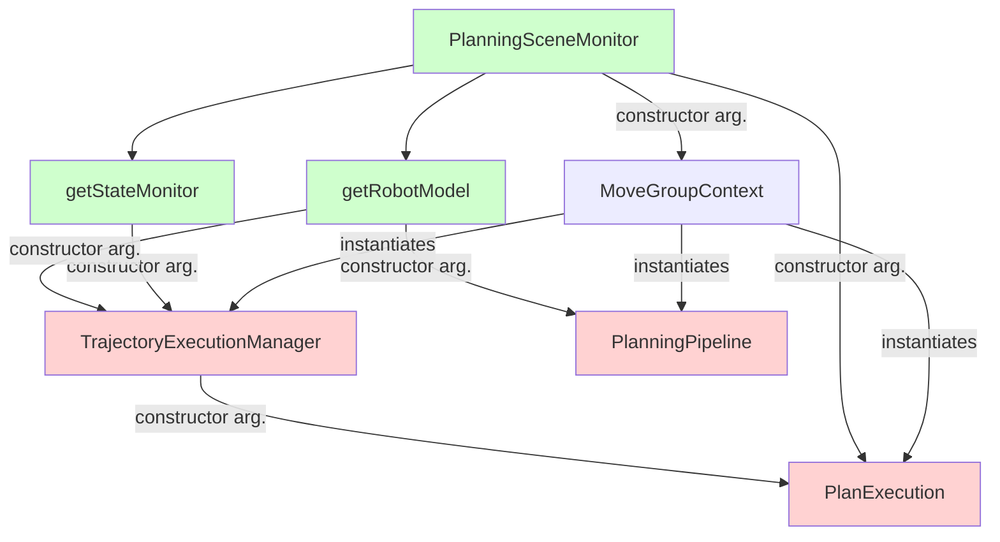
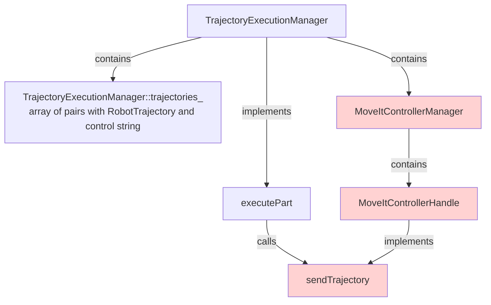

# Concepts 

| Concept | name space |class | task |
| ------- | -----      | ---- | ---- |
| Planning Scene Monitor | `planning_scene_monitor` | `PlanningSceneMonitor` | Perception and collision detection |
| Current State Monitor | `planning_scene_monitor` | `CurrentStateMonitor` | Listens to `joint_states` and update the state of the robot. |
| Motion Planning Problem | `planning_pipeline` | `PlanningPipeline` | Solve motion planning problem |
| Trajectory Execution Manager | `trajectory_execution_manager` | `TrajectoryExecutionManager` | High-level interface for motion execution, also a container of trajectories and controls |
| Trajectory Execution Context | `trajectory_execution_manager` | `TrajectoryExecutionContext` | Stores an array of `RobotTrajectory` and an array of respective controller strings |
| MoveIt Controller Manager | `moveit_ros_control_interface` | `MoveItControllerManager` | Interacts with control interfaces (contains controller handlers) |
| MoveIt Controller Handler | `moveit_ros_control_interface` | `MoveItControllerHandler` | Specific controller handler |
| Moveit Simple Controller Manager | `moveit_simple_controller_manager` | `MoveItSimpleControllerManager` | Default controller handler implementation of MoveIt |
| Action Based Controller Handler | `moveit_simple_controller_manager` | `ActionBasedControllerHandle` | Default MoveIt implementation of Controller handler [see here](https://github.com/ros-planning/moveit/blob/023b11def6329b165ed7509e5de9aec4c1e29c6c/moveit_plugins/moveit_simple_controller_manager/include/moveit_simple_controller_manager/action_based_controller_handle.h#L71) |
| Follow joint trajectory handler | `moveit_simple_controller_manager` | `FollowJointTrajectoryControllerHandle` | [see here](https://github.com/ros-planning/moveit/blob/023b11def6329b165ed7509e5de9aec4c1e29c6c/moveit_plugins/moveit_simple_controller_manager/include/moveit_simple_controller_manager/follow_joint_trajectory_controller_handle.h#L49) |

## Movegroup context

The `MoveGroupContext` is [declared here](https://github.com/ros-planning/moveit/blob/45e2be9879880ac9c18b228c64ca7c0d17d5041d/moveit_ros/move_group/include/moveit/move_group/move_group_context.h#L67) and [defined here](https://github.com/ros-planning/moveit/blob/45e2be9879880ac9c18b228c64ca7c0d17d5041d/moveit_ros/move_group/src/move_group_context.cpp#L43).
The `MoveGroupContext` is a container of the following elements, which also instantiates
- `planning_scene_monitor::PlanningSceneMonitorPtr planning_scene_monitor_`
- `trajectory_execution_manager::TrajectoryExecutionManagerPtr trajectory_execution_manager_`
- `planning_pipeline::PlanningPipelinePtr planning_pipeline_`
- `plan_execution::PlanExecutionPtr plan_execution_`
- `plan_execution::PlanWithSensingPtr plan_with_sensing_`


## Trajectory Execution Manager


The `TrajectoryExecutionManager` [declared here](https://github.com/ros-planning/moveit/blob/45e2be9879880ac9c18b228c64ca7c0d17d5041d/moveit_ros/planning/trajectory_execution_manager/include/moveit/trajectory_execution_manager/trajectory_execution_manager.h#L60) and [defined here](https://github.com/ros-planning/moveit/blob/45e2be9879880ac9c18b228c64ca7c0d17d5041d/moveit_ros/planning/trajectory_execution_manager/src/trajectory_execution_manager.cpp#L81) is the MoveIt class for managing controllers and the execution of trajectories.
It allows two main operations:

1. `push()` with main implementation [declared here](https://github.com/ros-planning/moveit/blob/45e2be9879880ac9c18b228c64ca7c0d17d5041d/moveit_ros/planning/trajectory_execution_manager/include/moveit/trajectory_execution_manager/trajectory_execution_manager.h#L152) and [defined here](). Stores a pair with a  `moveit_msgs::RobotTrajectory` and a string with a control in an instance of `TrajectoryExecutionContext` which is stored in the private variable `std::vector<TrajectoryExecutionContext*> trajectories_`.
2. `execute()` with main implementation [declared here](https://github.com/ros-planning/moveit_ros/blob/200ff00b2cad2c49811991b3af64cab5eb19f6fb/planning/trajectory_execution_manager/include/moveit/trajectory_execution_manager/trajectory_execution_manager.h#L138) and [defined here](https://github.com/ros-planning/moveit_ros/blob/200ff00b2cad2c49811991b3af64cab5eb19f6fb/planning/trajectory_execution_manager/include/moveit/trajectory_execution_manager/trajectory_execution_manager.h#L141). Launches a thread [here](https://github.com/ros-planning/moveit_ros/blob/200ff00b2cad2c49811991b3af64cab5eb19f6fb/planning/trajectory_execution_manager/src/trajectory_execution_manager.cpp#L1006) implemented [here](https://github.com/ros-planning/moveit_ros/blob/200ff00b2cad2c49811991b3af64cab5eb19f6fb/planning/trajectory_execution_manager/src/trajectory_execution_manager.cpp#L1048) passes the appropriate trajectories to different controllers, monitors execution, optionally waits for completion of the execution and, very importantly, switches active controllers as needed (optionally) to be able to execute the specified trajectories.
This execute each trajectory in `this->trajectories_` with [executePart](https://github.com/ros-planning/moveit_ros/blob/200ff00b2cad2c49811991b3af64cab5eb19f6fb/planning/trajectory_execution_manager/src/trajectory_execution_manager.cpp#L1091)

| Ros parameters | type | task | Default value in code |
| -------------- | ---- | ---- | --------------------- |
| `moveit_manage_controllers` | `bool` | [see here](https://github.com/ros-planning/moveit_ros/blob/200ff00b2cad2c49811991b3af64cab5eb19f6fb/planning/trajectory_execution_manager/src/trajectory_execution_manager.cpp#L685) and [here](https://github.com/ros-planning/moveit_ros/blob/200ff00b2cad2c49811991b3af64cab5eb19f6fb/planning/trajectory_execution_manager/src/trajectory_execution_manager.cpp#L724) | `false` |
| `allowed_execution_duration_scaling` | `double` | Execution time scaling [see here](https://github.com/ros-planning/moveit_ros/blob/200ff00b2cad2c49811991b3af64cab5eb19f6fb/planning/trajectory_execution_manager/src/trajectory_execution_manager.cpp#L1197) | `1.1`|
| `allowed_goal_duration_margin` |`double`| Extra time to finish the task [see here](https://github.com/ros-planning/moveit_ros/blob/200ff00b2cad2c49811991b3af64cab5eb19f6fb/planning/trajectory_execution_manager/src/trajectory_execution_manager.cpp#L1197)| `0.5` secs|
| `moveit_controller_manager` | `string`| Controller manager plugin | Looks for a unique plugin definition without the plugin loader, if its fails the controller manager is not instantiated. |


## MoveIt Simple Controller Manager

[Declared and defined here](https://github.com/ros-planning/moveit/blob/023b11def6329b165ed7509e5de9aec4c1e29c6c/moveit_plugins/moveit_simple_controller_manager/src/moveit_simple_controller_manager.cpp#L53). This is the default implementation of the `MoveItControllerManager` plugin.
This type implements a MoveIt Action Based Controller Handler for Follow Joint Trajectory action [here](https://github.com/ros-planning/moveit/blob/023b11def6329b165ed7509e5de9aec4c1e29c6c/moveit_plugins/moveit_simple_controller_manager/src/moveit_simple_controller_manager.cpp#L126).

| Ros Parameter | type |  |
| ------------- | ---- | ---- |
| `controller_list` | array of structs with `name`, `action_ns`, `type` and `joints`|  |


## Initialize function
```C++
void TrajectoryExecutionManager::initialize()
{
  reconfigure_impl_ = NULL;
  verbose_ = false;
  execution_complete_ = true;
  stop_continuous_execution_ = false;
  current_context_ = -1;
  last_execution_status_ = moveit_controller_manager::ExecutionStatus::SUCCEEDED;
  run_continuous_execution_thread_ = true;
  execution_duration_monitoring_ = true;
  execution_velocity_scaling_ = 1.0;

  // load the controller manager plugin with try 
    controller_manager_loader_.reset(new pluginlib::ClassLoader<moveit_controller_manager::MoveItControllerManager>("moveit_core", "moveit_controller_manager::MoveItControllerManager"));

  if (controller_manager_loader_)
  {
    std::string controller;
    if (!node_handle_.getParam("moveit_controller_manager", controller))
    {
      const std::vector<std::string> &classes = controller_manager_loader_->getDeclaredClasses();
      if (classes.size() == 1)
        controller = classes[0];
    }
    if (!controller.empty())
        controller_manager_.reset(controller_manager_loader_->createUnmanagedInstance(controller));
  }

  reloadControllerInformation();
  event_topic_subscriber_ = root_node_handle_.subscribe(EXECUTION_EVENT_TOPIC, 100, &TrajectoryExecutionManager::receiveEvent, this);

  reconfigure_impl_ = new DynamicReconfigureImpl(this);

```

## Execute Thread

```C++
void TrajectoryExecutionManager::executeThread(const ExecutionCompleteCallback &callback, const PathSegmentCompleteCallback &part_callback, bool auto_clear)
{
  // if we already got a stop request before we even started anything, we abort
  if (execution_complete_)
  {
    last_execution_status_ = moveit_controller_manager::ExecutionStatus::ABORTED;
    if (callback)
      callback(last_execution_status_);
    return;
  }
  // assume everything will be OK
  last_execution_status_ = moveit_controller_manager::ExecutionStatus::SUCCEEDED;
  // execute each trajectory in this->trajectories_, one after the other (executePart() is blocking) or until one fails.
  // on failure, the status is set by executePart(). Otherwise, it will remain as set above (success)
  for (std::size_t i = 0 ; i < trajectories_.size() ; ++i)
  {
    bool epart = executePart(i);
    if (epart && part_callback)
      part_callback(i);
    if (!epart || execution_complete_)
      break;
  }

  ROS_DEBUG_NAMED("traj_execution","Completed trajectory execution with status %s ...", last_execution_status_.asString().c_str());

  // notify whoever is waiting for the event of trajectory completion
  execution_state_mutex_.lock();
  execution_complete_ = true;
  execution_state_mutex_.unlock();
  execution_complete_condition_.notify_all();

  // clear the paths just executed, if needed
  if (auto_clear)
    clear();

  // call user-specified callback
  if (callback)
    callback(last_execution_status_);
}
```

## Execute part 
```C++
bool TrajectoryExecutionManager::executePart(std::size_t part_index){
  // 1. Take the trajectory to be executed
  TrajectoryExecutionContext &context = *trajectories_[part_index];
  // 2. tst if the controllers are active
  if (!ensureActiveControllers(context.controllers_)){
    last_execution_status_ = moveit_controller_manager::ExecutionStatus::ABORTED;
    return false;
  }
// stop if we are already asked to do so
    if (execution_complete_) return false;

    std::vector<moveit_controller_manager::MoveItControllerHandlePtr> handles;
    {
      boost::mutex::scoped_lock slock(execution_state_mutex_);
      if (!execution_complete_)
      {
        current_context_ = part_index;
        active_handles_.resize(context.controllers_.size());
        for (std::size_t i = 0 ; i < context.controllers_.size() ; ++i)
        {
          moveit_controller_manager::MoveItControllerHandlePtr h;
          h = controller_manager_->getControllerHandle(context.controllers_[i]);
          active_handles_[i] = h;
        }
        handles = active_handles_; // keep a copy for later, to avoid thread safety issues
        for (std::size_t i = 0 ; i < context.trajectory_parts_.size() ; ++i)
        {
          bool ok = false;
          ok = active_handles_[i]->sendTrajectory(context.trajectory_parts_[i]);
          if (!ok)
          {
            for (std::size_t j = 0 ; j < i ; ++j)
                active_handles_[j]->cancelExecution();
            // ...
            last_execution_status_ = moveit_controller_manager::ExecutionStatus::ABORTED;
            return false;
          }
        }
      }
    }

    ros::Duration expected_trajectory_duration(0.0);
    int longest_part = -1;
    // compute the expected duration of the trajectory and find the part of the trajectory that takes longest to execute
    // ...
    // add 10% + 0.5s to the expected duration; this is just to allow things to finish propery
    expected_trajectory_duration = expected_trajectory_duration * allowed_execution_duration_scaling_ + ros::Duration(allowed_goal_duration_margin_);

    if (longest_part >= 0)
    {
      boost::mutex::scoped_lock slock(time_index_mutex_);

      // construct a map from expected time to state index, for easy access to expected state location
      if (context.trajectory_parts_[longest_part].joint_trajectory.points.size() >= context.trajectory_parts_[longest_part].multi_dof_joint_trajectory.points.size())
      {
        ros::Duration d(0.0);
        if (context.trajectory_parts_[longest_part].joint_trajectory.header.stamp > current_time)
          d = context.trajectory_parts_[longest_part].joint_trajectory.header.stamp - current_time;
        for (std::size_t j = 0 ; j < context.trajectory_parts_[longest_part].joint_trajectory.points.size() ; ++j)
          time_index_.push_back(current_time + d + context.trajectory_parts_[longest_part].joint_trajectory.points[j].time_from_start);
      }
      else
      {
        ros::Duration d(0.0);
        if (context.trajectory_parts_[longest_part].multi_dof_joint_trajectory.header.stamp > current_time)
          d = context.trajectory_parts_[longest_part].multi_dof_joint_trajectory.header.stamp - current_time;
        for (std::size_t j = 0 ; j < context.trajectory_parts_[longest_part].multi_dof_joint_trajectory.points.size() ; ++j)
          time_index_.push_back(current_time + d + context.trajectory_parts_[longest_part].multi_dof_joint_trajectory.points[j].time_from_start);
      }
    }

    bool result = true;
    for (std::size_t i = 0 ; i < handles.size() ; ++i)
    {
      if (execution_duration_monitoring_)
      {
        if (!handles[i]->waitForExecution(expected_trajectory_duration))
          if (!execution_complete_ && ros::Time::now() - current_time > expected_trajectory_duration)
          {
            ROS_ERROR_NAMED("traj_execution","Controller is taking too long to execute trajectory (the expected upper bound for the trajectory execution was %lf seconds). Stopping trajectory.", expected_trajectory_duration.toSec());
            {
              boost::mutex::scoped_lock slock(execution_state_mutex_);
              stopExecutionInternal(); // this is trally tricky. we can't call stopExecution() here, so we call the internal function only
            }
            last_execution_status_ = moveit_controller_manager::ExecutionStatus::TIMED_OUT;
            result = false;
            break;
          }
      }
      else
        handles[i]->waitForExecution();

      // if something made the trajectory stop, we stop this thread too
      if (execution_complete_){
        result = false;
        break;
      }
      else
        if (handles[i]->getLastExecutionStatus() != moveit_controller_manager::ExecutionStatus::SUCCEEDED){
          ROS_WARN_STREAM_NAMED("traj_execution","Controller handle " << handles[i]->getName() << " reports status "
            << handles[i]->getLastExecutionStatus().asString());
          last_execution_status_ = handles[i]->getLastExecutionStatus();
          result = false;
        }
    }

    // clear the active handles and indexes
    // ...
    return result;
}
```
# MoveIt Controller Manager Plugin

- `moveit_ros_control_interface::MoveItControllerManager` **Is a Base Plugin** [declared and defined here](https://github.com/ros-planning/moveit/blob/023b11def6329b165ed7509e5de9aec4c1e29c6c/moveit_plugins/moveit_ros_control_interface/src/controller_manager_plugin.cpp)

- `moveit_controller_manager::MoveItControllerManager` **Is not a bas Plugin** [declared here](https://github.com/ros-planning/moveit/blob/023b11def6329b165ed7509e5de9aec4c1e29c6c/moveit_core/controller_manager/include/moveit/controller_manager/controller_manager.h#L156).

| `moveit_controller_manager::MoveItControllerManager` pure virtual function | task |
| ----- | --- |
| `void getActiveControllers(std::vector<std::string> & names)` |  |
| `MoveItControllerHandlePtr getControllerHandle(const std::string & name)` | [example](https://github.com/ros-planning/moveit/blob/023b11def6329b165ed7509e5de9aec4c1e29c6c/moveit_plugins/moveit_simple_controller_manager/src/moveit_simple_controller_manager.cpp#L171)|
| `void getControllerJoints(const std::string & name,std::vector<std::string> & joints)` | |
| `ControllerState getControllerState(const std::string & name)` | |
| `void getControllersList(std::vector<std::string> & names)` | |
| `bool switchControllers(const std::vector<std::string> & activate,const std::vector<std::string> & deactivate)` | |

The controller manager pluging implements specific interaction with controllers.
This is an abstract class that defines the functionality needed by `TrajectoryExecutionManager` and needs to be implemented for each robot type.

The default Controller manager is `moveit_simple_controller_manager/MoveItSimpleControllerManager` [declared here](https://github.com/ros-planning/moveit/blob/023b11def6329b165ed7509e5de9aec4c1e29c6c/moveit_plugins/moveit_simple_controller_manager/src/moveit_simple_controller_manager.cpp#L53) and [defined here](https://github.com/ros-planning/moveit/blob/023b11def6329b165ed7509e5de9aec4c1e29c6c/moveit_plugins/moveit_simple_controller_manager/src/moveit_simple_controller_manager.cpp).
It supports Joint Trajectory Control [has stated here](https://github.com/ros-planning/moveit/blob/023b11def6329b165ed7509e5de9aec4c1e29c6c/moveit_plugins/moveit_simple_controller_manager/src/moveit_simple_controller_manager.cpp#L126)

 MoveItControllerHandle 
 cancelExecution()
 getLastExecutionStatus()
 sendTrajectory(const moveit_msgs::RobotTrajectory & trajectory)
 waitForExecution(const ros::Duration & timeout=ros::Duration (0))
     +getName() const
      [members]
     #name_
